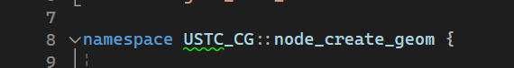
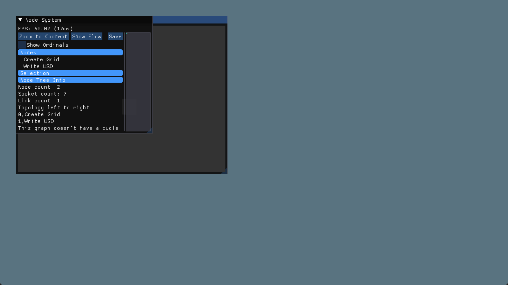
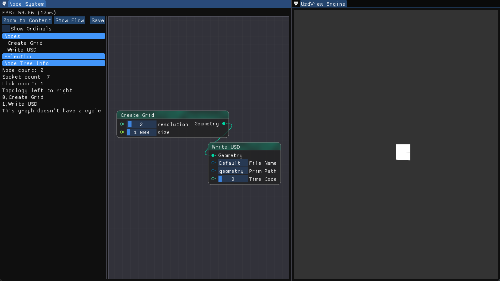
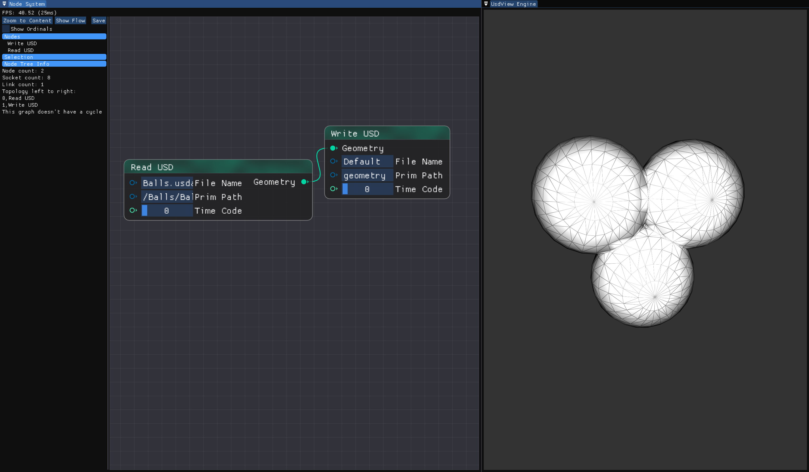
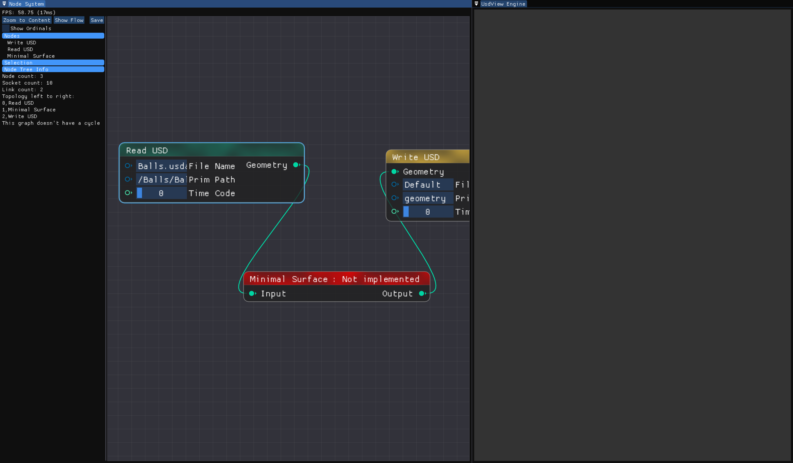
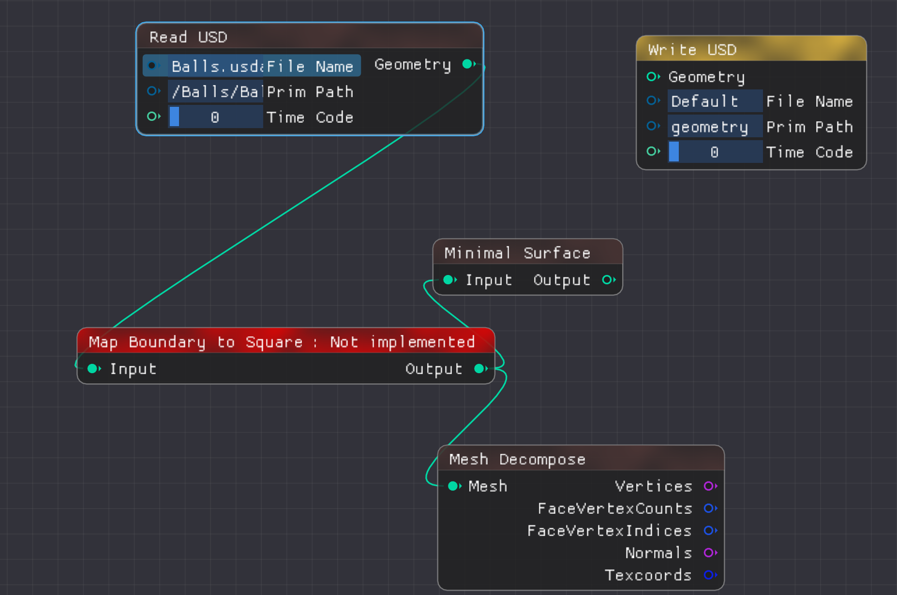
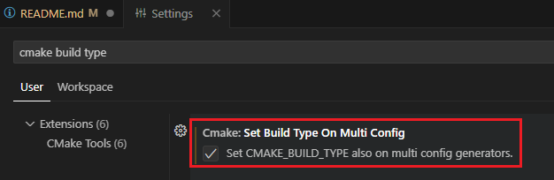
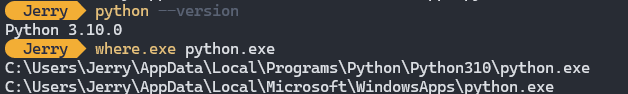

# USTC_CG_2024
The assignments for the computer graphics course for 2024，Spring.

# Build
首先执行git系列操作
```
git fetch upstream
git merge upstream/main
git submodule update --init --recursive
```
然后安装下方依赖。

# Dependencies

## Windows + MSVC
强烈建议在Windows系统下使用本框架，并使用最新版MSVC进行构建和编译。

### Python 3.10.11 
[下载地址](https://www.python.org/downloads/release/python-31011/)

安装时无需勾选Debug库，需要加入path。
### 其他依赖
本框架依赖于 https://github.com/Jerry-Shen0527/USTC_CG_2024_Dependencies 。 

我们为使用Windows操作系统的同学提供了预构建的依赖库：https://rec.ustc.edu.cn/share/4d6a6e00-e04a-11ee-bd1a-2561f5e1cc93 ，因此使用Windows的同学无需clone Dependencies仓库，只需下载并执行以下步骤。

下载SDK，解压到此README所在的文件夹，执行
```
python.exe configure.py
```
最后使用编辑器/IDE打开文件夹，或cmake后打开sln文件，即配置完成。

### 可选
python依赖：PyOpenGL PySide6 PySide2 numpy

推荐使用pip安装。

## Other Platform
clone (recursive) https://github.com/Jerry-Shen0527/USTC_CG_2024_Dependencies

在该系统下执行该仓库的build.py，检查过程中报出的依赖缺失，并安装该依赖在该平台的对应版本。欢迎同学们向该仓库提交跨平台构建脚本所需的改动。

将生成的SDK文件夹转移到本目录下，并执行
```
python.exe configure.py
```

# Remark

- 由于注册节点时使用了简易的代码生成机制，添加新节点时对于namespace行的要求比较严格，需要大括号和namespace声明在同一行，需要中间有空格，且代码中不能出现中文变量和注释。类似这样



- 稍后助教会对此限制进行改进。

# Usage (Kick Start for HW4)

构建并执行 `engine_test.exe`

你将看到



对其进行摆放，在节点系统中单击右键，放置如图节点：



你应该看到如图所示的结果。添加首个节点后可以点击Zoom to Content，来将节点居中（首次启动时会有一个初始缩放数值，并不能看到你添加的节点。后续使用将有正常的初始值。）

节点和渲染窗口都可用左右键进行交互。

读取输入网格：


HW4 极小曲面


HW4 参数化 （不完整，请按照理解完成节点图连接）


实现节点时，移除节点中的"not implemeted"的throw，即可以正常执行。

# Trouble Shoot
1. 添加新节点时编译错误：

- 由于注册节点时使用了简易的代码生成机制，添加新节点时对于namespace行的要求比较严格，需要大括号和namespace声明在同一行，需要中间有空格，且代码中不能出现中文变量和注释。类似这样


- 稍后助教会对此限制进行改进。

2. vscode在Release模式下无法找到SDK.



3. Python version mismatch



检查Python版本是否为3.10，如果不是，将排在3.10之前的设法移除（修改环境变量，或将排在前面的临时改名为python_bak.exe）。

4. 对于使用双显卡笔记本的同学，如果渲染窗口没有渲染结果且Debug Console有关于GL的报错输出，请分别测试两个显卡的运行结果，通常有一个可以正常执行。

