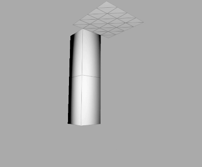
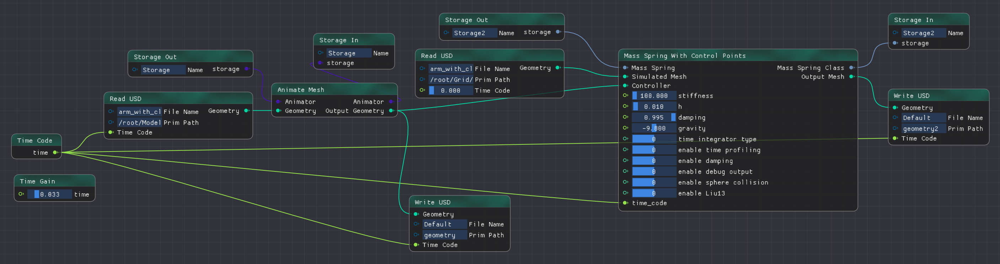
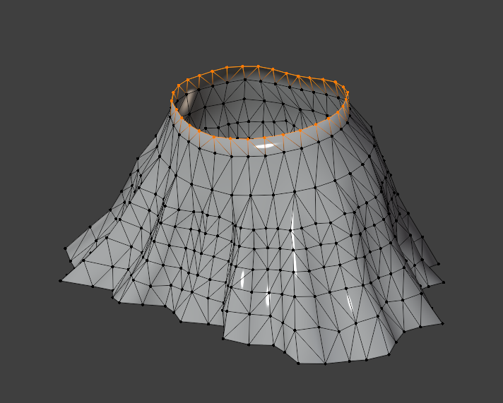
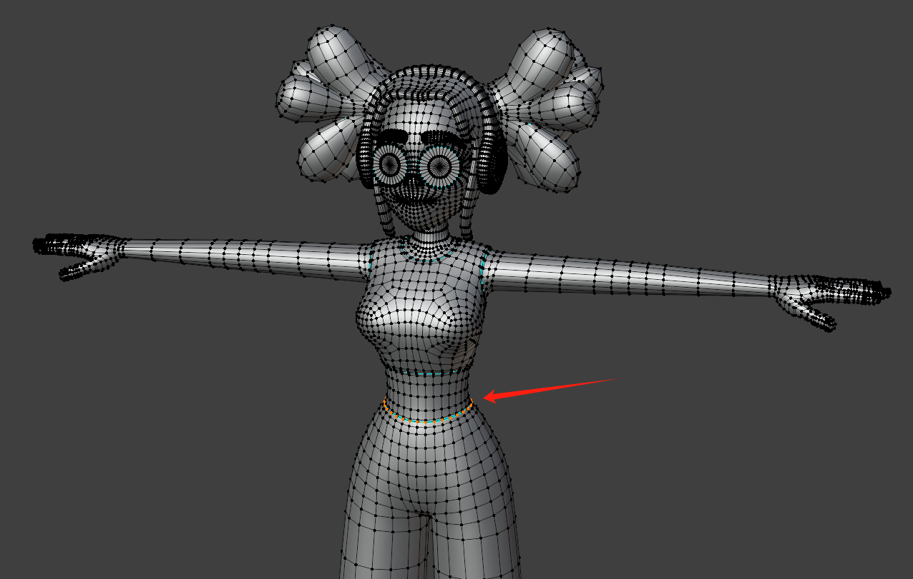
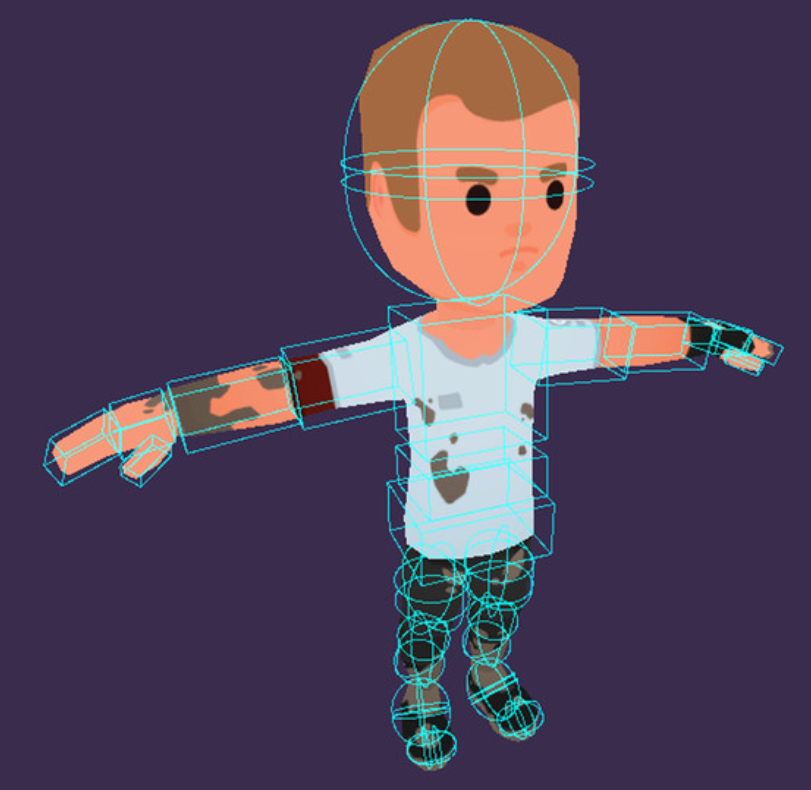
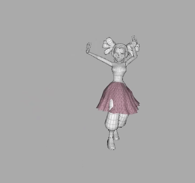
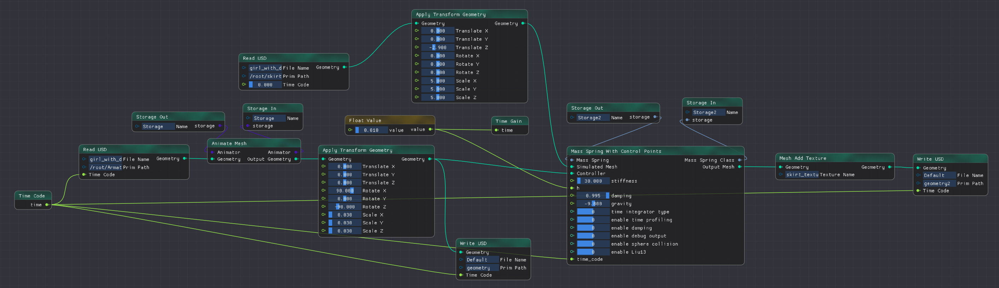

# Part 2: 骨骼动画 + 布料仿真

在这一部分，我们将尝试结合基于数据方法的骨骼动画技术（本次作业）和基于物理的仿真技术（HW8 弹簧质点仿真），实现裙子随着人体一起运动并尝试考虑简单的碰撞处理。

**本部分为HW10选做内容。由于涉及到课程上没有仔细讲的碰撞处理内容，因此不做过多要求，以尝试与体验为主。**

## 1. 布料与物体的连接

在HW8中，我们为布料设置了静止不动的Dirichlet边界点（固定点），为了让布料跟随被骨骼驱动的蒙皮运动，我们可以直接让这些边界点跟随蒙皮上的一些控制点一起运动。

为此，我们可以通过Blender中的“顶点组”功能，分别在蒙皮上与布料上指定一些控制顶点，然后在每个时间步读取这些控制点并控制它们的位置相同（具体实现可见[`node_mass_spring_with_control_points.cpp`](../../../Framework3D/source/nodes/nodes/geometry/node_mass_spring_with_control_points.cpp)）

那么一个简单的示例如下，我们可以在Arm模型上附着一个布料，并使用HW8我们已经实现的弹簧质点系统仿真这个布料，新增的节点为[`Mass Spring with Control Points`](../../../Framework3D/source/nodes/nodes/geometry/node_mass_spring_with_control_points.cpp)。

    
 

运行上图的节点图已经提供在了[`../data/GeoNodeSystem-arm-with-cloth.json`](../data/GeoNodeSystem-arm-with-cloth.json) （替换可执行文件`engine_test.exe`所在文件夹的`GeoNodeSystem.json`）。

    
 

## 2. 布料与人体碰撞的处理 

布料与人体上指定的控制点如下所示：

    
 

    
 

为了处理布料与人体的碰撞，一种简单的做法是为人体创建一些由简单几何体组合而成的简化模型(proxy model) 用于进行碰撞检测与处理，如下图所示，这是游戏中常用的做法。

    
 

在本次作业中，你可以通过girl模型上的固定点大致计算模型腰部所在位置，假设在该位置存在一个球体，然后通过HW8中的选做内容-布料与球体的碰撞来进行一个简单的碰撞处理。

更多碰撞处理内容可以参考老师上课的PPT和[GAMES103-基于物理的计算机动画入门: Lec9. Collision Handling](https://www.bilibili.com/video/BV12Q4y1S73g/?p=9&share_source=copy_web&vd_source=19d965dd50171e7e3327ff6e149567c2)。

## 3. 提供的初始结果

下图的结果没有考虑布料自碰撞和与人体碰撞，所使用的usda文件下载链接：[rec link](https://rec.ustc.edu.cn/share/e3bbfa90-1525-11ef-86c4-b5a47b81827a)

    
 

需要连接的节点图为（已经提供在了[`../data/GeoNodeSystem-girl-with-skirt.json`](../data/GeoNodeSystem-girl-with-skirt.json)）：

    
 

可以自行实现上文介绍的布料与人体碰撞的处理方法，甚至进一步考虑布料自碰撞的处理。

**请在报告中介绍你采取的方法以及处理前后的结果对比动图/视频。**

## 参考资料
[GAMES103-基于物理的计算机动画入门: Lec9. Collision Handling](https://www.bilibili.com/video/BV12Q4y1S73g/?p=9&share_source=copy_web&vd_source=19d965dd50171e7e3327ff6e149567c2)