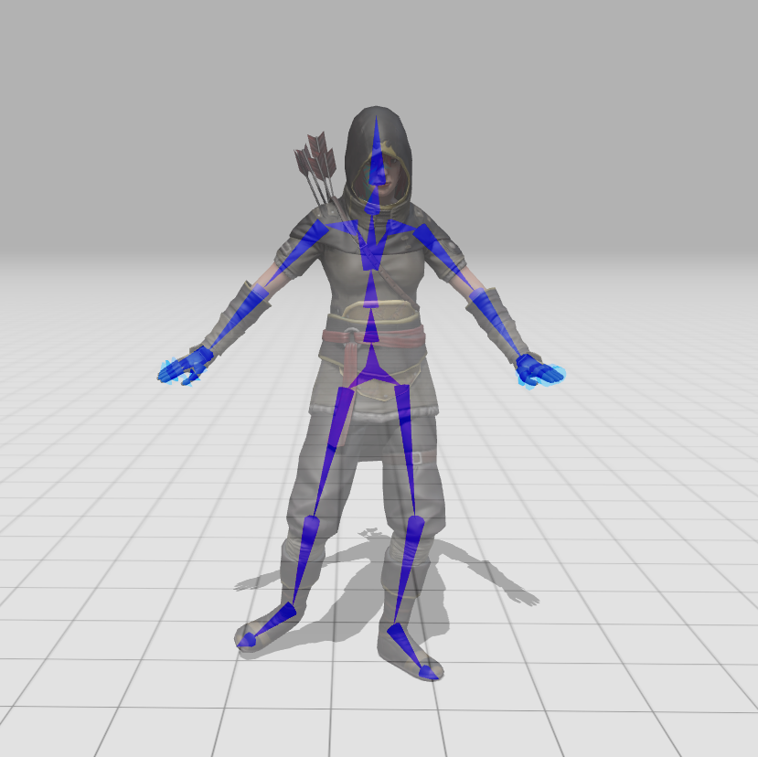
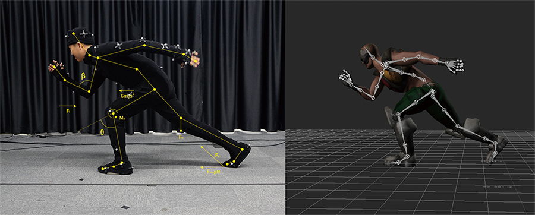
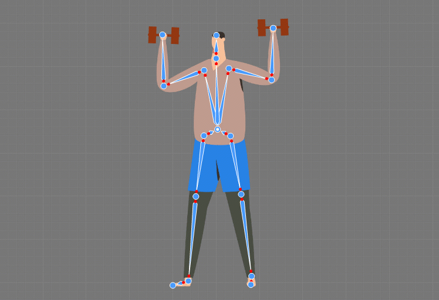
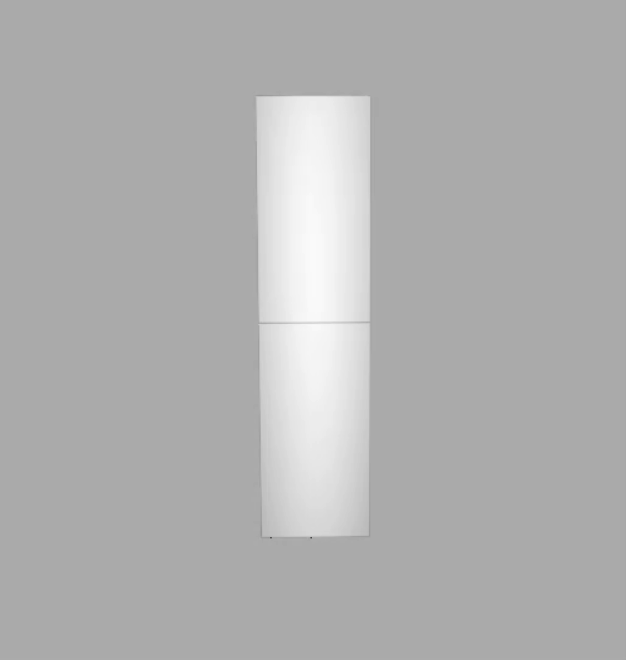
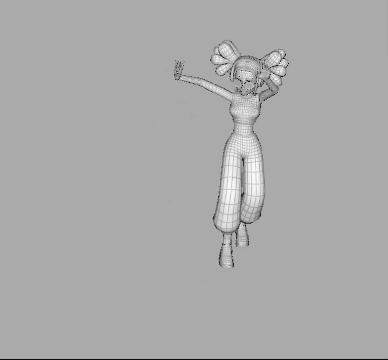
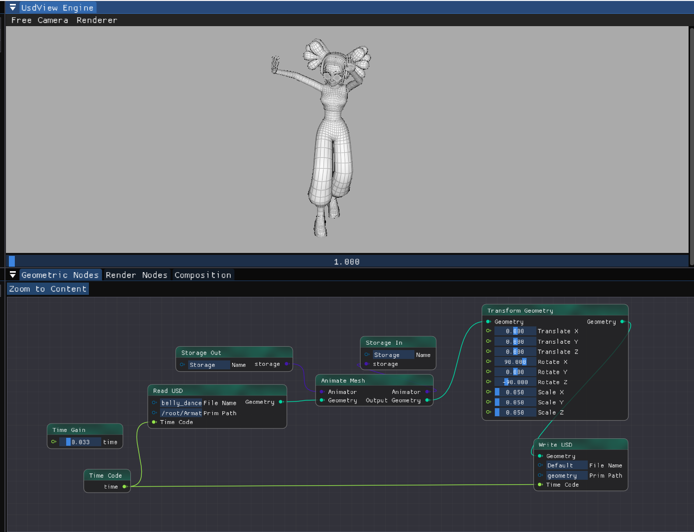

# 角色动画简明教程

在之前两次作业中，我们都是从物理方程出发求解物质的运动（弹性体、布料、流体），但由于自然界中物理和材质的复杂性，很多生物运动如人体的运动很难通过物理方程的形式准确刻画。本次作业我们将介绍另一种通过预定义骨骼驱动表面模型运动的方法：骨骼动画，它和动作捕捉等当下流行的电影动画制造方式密切相关。 

> 用>包裹的引用格式呈现的内容为扩展阅读/思考内容，为了实现本次作业可以不看

## 1. 什么是骨骼动画

<div  align="center">    
 
</div>

如上图所示，骨骼动画由两个主要部分构成：

1. 骨骼：低自由度的铰链系统，作为驱动器

2. 蒙皮：表面的mesh，绑定到骨骼，mesh顶点的运动受到多个骨骼关节的共同影响，通过插值等方式计算其最终空间坐标。

由于其广泛的适用性和高效性，骨骼动画技术在游戏和动画中十分常用。

<div  align="center">    
 
</div>

## 2. 骨骼关节的变换关系

<div  align="center">    
 
</div>

在上面的动图中，我们可以看到父关节的运动会带动子关节的运动。会形成一个类似下图的树状结构：

<div  align="center">    
 
</div>

我们在[`animator.h`](../../../Framework3D/source/nodes/nodes/geometry/character_animation/animator.h)中提供了`JointTree`类。

接下来，我们介绍一些重要的transform矩阵：

+ `localTransform`: 关节在局部坐标系下的坐标变换（4x4矩阵）

+ `worldTransform`: (或称为 global transform): 关节在世界坐标系下的坐标变换（4x4矩阵），对于根关节，我们作业中可以直接设置其`worldTransform = localTranform`。

+ `bindTransform`: 模型在绑定姿势（Bind Pose）下（如 T-pose），关节相对于mesh顶点的位置和方向，它常在3D模型的创建过程中定义，并且在动画的整个生命周期中保持不变。它的作用我们很快会在下面的蒙皮运动小节看到。

那么，子关节在`worldTransform`应该是父关节的`worldTransform`再复合上子关节的`localTransform` (公式请自己推导)。

为了实现这一变换，本次作业中，你需要实现的是[`animator.cpp`](../../../Framework3D/source/nodes/nodes/geometry/character_animation/animator.cpp)中的函数：

```c++
void Joint::compute_world_transform()
{
    // ---------- (HW TODO) Compute world space trasform of this joint -----------------

    // --------------------------------------------------------------------------------
}

void JointTree::compute_world_transforms_for_each_joint()
{
    // ----------- (HW_TODO) Traverse all joint and compute its world space transform ---
	// Call compute_world_transform for each joint
    // ---------------------------------------------
}
```

## 3. 骨骼如何驱动蒙皮运动

蒙皮上的每个顶点可能受到多个关节影响，其运动是多个关节transform线性组合作用后的结果（这种做法被称为[Linear Blend Skinning，LBS](http://graphics.cs.cmu.edu/courses/15-466-f17/notes/skinning.html)），每个顶点相关的关节index和响应的影响权重存储在`jointWeight`和`jointIndices`中，这两个数组的长度为 顶点数×对其有影响的关节数，影响每个顶点的关节数相同。

为了让我们的mesh的顶点的空间位置从“相对于世界坐标系原点”转换为“相对于影响这个顶点的关节”，根据`bindTransform`的定义，我们可以通过对其求逆实现，称为逆绑定变换（Inverse Bind Transforms, IBTs）

最后，mesh顶点位置的更新公式如下：

$$
\widetilde{\mathbf{x}} = \sum_i^n w_i \mathbf{T}_i \mathbf{B}_i^{-1} \widetilde{\mathbf{x}}^0
$$

其中 $\mathbf{T}_i$ 和 $\mathbf{B}_i$ 分别为第 $i$ 个关节的 `worldTransform`和`bindTransform`,  $n$ 为对顶点 $\mathbf{x}$ 产生影响的关节数 （需要通过`jointIndices`的长度除以顶点数得到）， $\widetilde{\mathbf{x}} = [\vec{\mathbf{x}}, 1] \in \mathbb{R}^{4 \times 1}$  。

这里4x4矩阵对3维向量的变换可以使用`GfMatrix4f`的[`TransformAffine`](https://openusd.org/dev/api/class_gf_matrix4f.html#ac379f460c0ef02fddd31ee3dc11f284d:~:text=%E2%97%86-,TransformAffine(),-%5B2/2%5D) 函数实现。

你需要实现[`animator.cpp`](../../../Framework3D/source/nodes/nodes/geometry/character_animation/animator.cpp)中的函数：

```c++
void Animator::update_mesh_vertices()
{
	// ----------- (HW_TODO) Update mesh vertices according to the current joint transforms ----
	// 1. get skel_->jointIndices and skel_->jointWeight;
	// 2. For each vertex, compute the new position by transforming the rest position with the joint transforms
	// 2. Update the vertex position in the mesh
	// --------------------------------------------------------------------------------
}
```

## 4. 示例结果 & 节点图

如果关节的transform变换和蒙皮顶点的更新实现正确，从`arm.usda`中可以得到如下的动画结果（建议大家先在这个小文件上测试）：

<div  align="center">    
 
</div>

节点图如下，`Prim Path`为`/Model/Mesh`。
<div  align="center">    
 
</div>

完成上面的结果后，可以尝试更大的mesh。从`belly_dance_girl.usda`中可以得到如下的动画结果（数据睿客网下载[链接](https://rec.ustc.edu.cn/share/97a11800-119e-11ef-ae31-47d3c2b414be)）：

<div  align="center">    
 
</div>

所需要连接的节点图如下, `Prim Path`为`/root/Armature/Ch03/Mesh_001`。

<div  align="center">    
 
</div>

恭喜你，至此已经完成了本次作业的必做部分！

**提交作业时，需要附上`arm.usda`和`belly_dance_girl.usda`的动画结果的视频或gif。**

如果有兴趣，可以自行添加新的动画文件进行展示：以下是一些可以考虑的动画资源网站（需要将相应的文件在Blender 4.1中导入并转存为usda格式，才能用于作业框架）：

1. Adobe的免费动画资源网站[Mixamo](https://www.mixamo.com/)，包含角色mesh和多种骨骼动画
2. miHoYo角色MMD资源整理 [链接](https://www.hoyolab.com/article/118389) 

> 拓展思考：如果有多个舞蹈动画文件顺序播放，考虑一个动作平滑切换到另一个动作，应该怎么在动作之间插值？

## (Optional) 骨骼动画 + 布料仿真

本次作业我们还有一个选做部分：通过结合骨骼动画与作业8：弹簧质点仿真实现衣服随人体的运动，将在[Part2：骨骼动画+布料仿真](./README-part2.md)中介绍。

## 参考资料 & 扩展阅读材料
1. [GAMES 105：计算机角色动画基础](https://games-105.github.io/)
2. [Game Engine Blog: How I Implemented Skeletal Animation](https://vladh.net/game-engine-skeletal-animation/)
