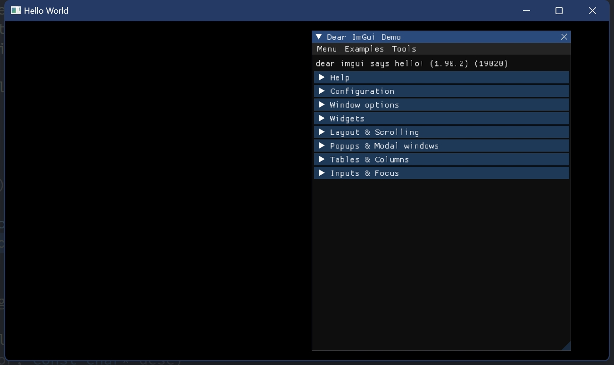
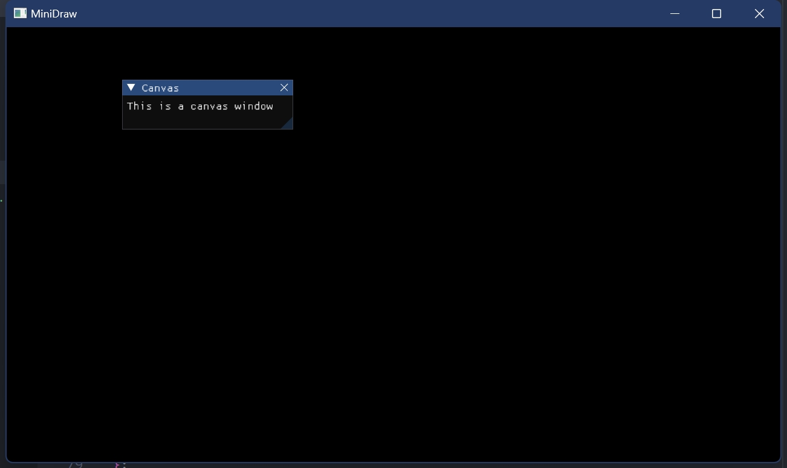
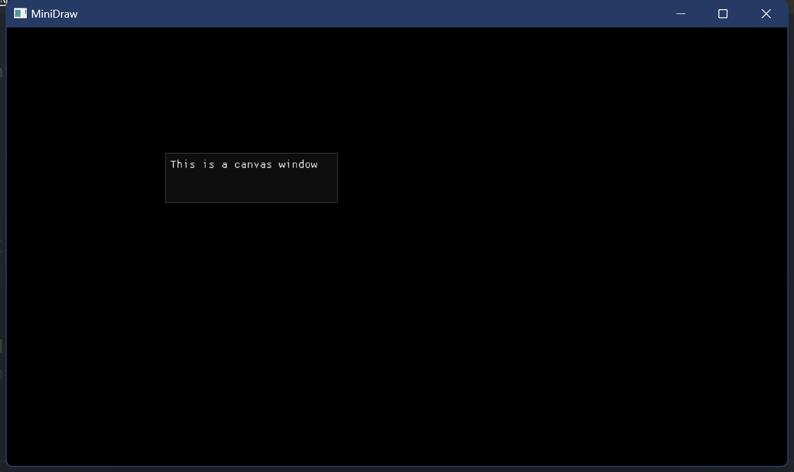
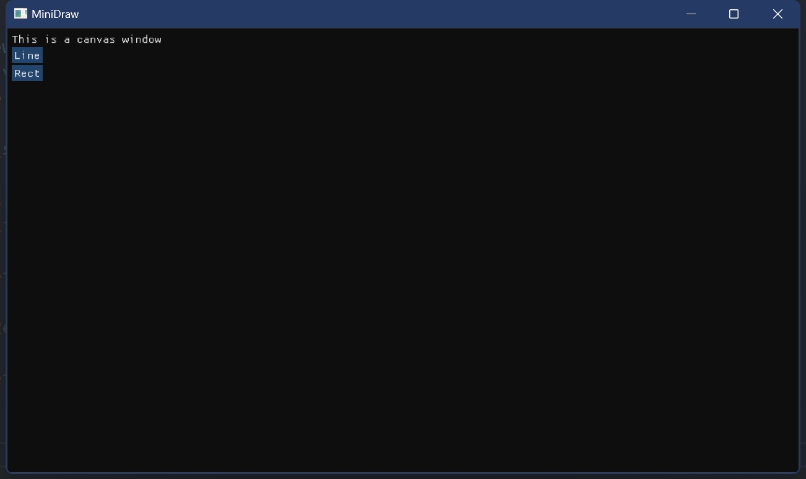
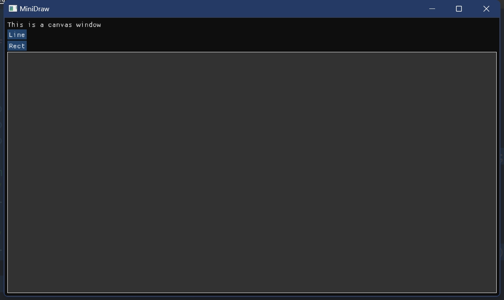
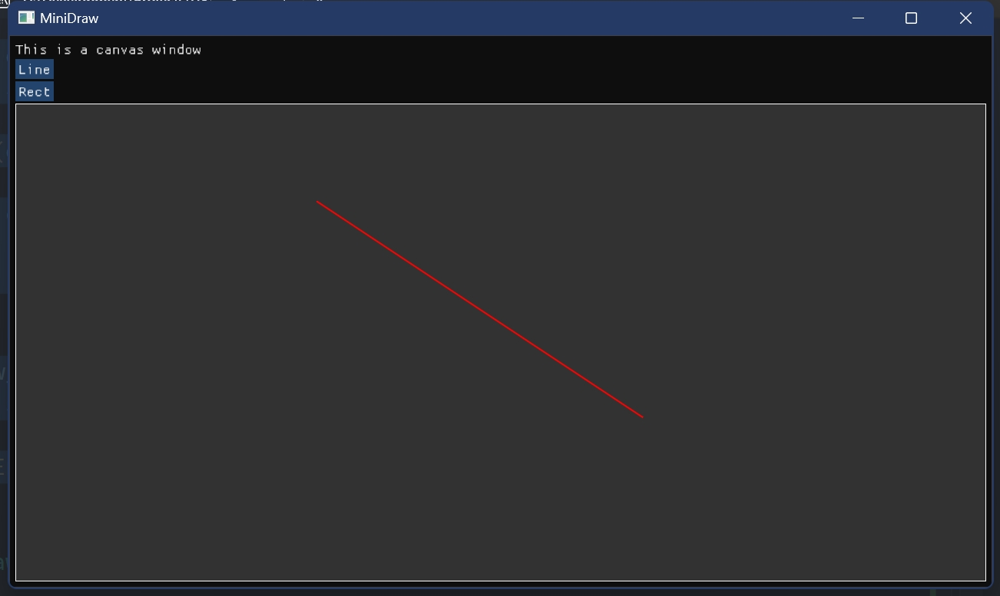
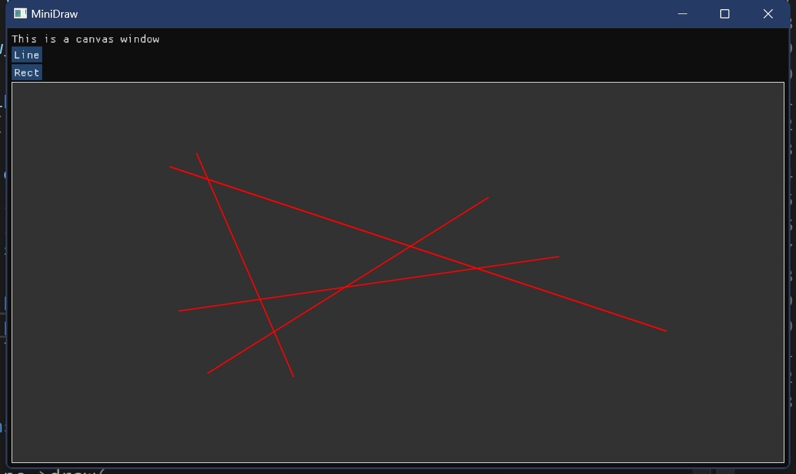

# ImGui 程序框架具体实现

我们主要关注 [view/](../../../Framework2D/include/view/) 中的相关类及其实现

其文件结构如下

```
view/
├── window.h        // 窗口类，OpenGL 和 ImGui 上下文初始化的封装
├── component.h     // UI 组件的抽象类
├── cmpt_canvas.h   // 实现绘图功能的组件类，继承自 Component 类
├── cmpt_image.h    // 实现图像可视化的组件类，继承自 Component 类（与 MiniDraw 无关）
└── shapes/         // 该文件夹下包含了用于绘图的各种形状类
    ├── shape.h         // 抽象父类
    ├── line.h          // 直线段，继承自 Shape 类
    ├── rect.h          // 矩形线框，继承自 Shape 类
    └── ...             // 可以实现更多...
```

## 1. MiniDraw 功能实现

### Step 1: 创建一个基本 Hello world 窗口

该部分的实现参考 [demo_hello_world.cpp](../../../Framework2D/src/demo/demo_hello_world.cpp)。

包含绘制窗口初始化的头文件 `window.h`，通过以下方式就可以构建一个名称为 `'Hello World'` 的默认窗口：创建 `USTC_CG::Window` 类型的变量 `w` > 初始化窗口 `w.init()` > 运行窗口 `w.run()`。 

```cpp
#include <stdexcept>

#include "view/window.h"

int main()
{
    try
    {
        USTC_CG::Window w("demo");
        if (!w.init())
            return 1;

        w.run();
        return 0;
    }
    catch (const std::exception& e)
    {
        fprintf(stderr, "Error: %s\n", e.what());
        return 1;
    }
}
```

这个窗口默认绘制了一个 ImGui 的 DemoWindow，其中包含了 ImGui 的帮助文档和可以实现的各种功能和效果，其代码实现可以查阅 `ImGui::ShowDemoWindow()` 函数，可供模仿学习。



### Step 2: 定制化窗口，在窗口中添加按钮等功能

该部分的实现可直接参考作业代码 [1_MiniDraw/](../../../Framework2D/src/assignments/1_MiniDraw/)。

定制化窗口，可以从前面的 `Window` 类派生一个子类，见 [window_mini_draw.h](../../../Framework2D/src/assignments/1_MiniDraw/window_minidraw.h) 中的 `MiniDraw` 类：

```cpp
#pragma once

#include "view/window.h"

#include ...

namespace USTC_CG
{
class MiniDraw : public Window
{
   public:
    explicit MiniDraw(const std::string& window_name);
    ~MiniDraw();

    void draw();    // 重载 Window 的绘制函数 draw()

   private:
    ...             // Priavte attributes
};
}  // namespace USTC_CG
```

这个重载 `Draw()` 函数中需要给出界面中的元素及其布局：

例如，可以使用 `ImGui::Begin()` 和 `ImGui::End()` 添加一个简单的显示文本的子窗口：

```cpp
void MiniDraw::draw()
{
    // flag_show_canvas_view 为bool类型，记录窗口的打开状态
    if (ImGui::Begin("Canvas", &flag_show_canvas_view))
    {
        ImGui::Text("This is a canvas window");
    }
    ImGui::End();
}
```



可以设置该窗口的若干显示属性，例如 `ImGuiWindowFlags_NoDecoration` 可以去掉上方的标签栏：

```cpp
void MiniDraw::draw()
{
    if (ImGui::Begin("Canvas", &flag_show_canvas_view, ImGuiWindowFlags_NoDecoration))
    {
        ImGui::Text("This is a canvas window");
    }
    ImGui::End();
}
```



通过调用 `ImGui::SetNextWindowPos()` 函数与 `ImGui::SetNextWindowSize()`函数，可以设置窗口的（左上角）位置以及大小。这里获取视窗大小，并且用它来设置窗口的属性，将窗口铺满整个屏幕：
```cpp
void MiniDraw::draw()
{
    // 设置窗口的位置和尺寸
    const ImGuiViewport* viewport = ImGui::GetMainViewport();
    ImGui::SetNextWindowPos(viewport->WorkPos);
    ImGui::SetNextWindowSize(viewport->WorkSize);
    if (ImGui::Begin("Canvas", &flag_show_canvas_view, ImGuiWindowFlags_NoDecoration))
    {
        ImGui::Text("This is a canvas window");
    }
    ImGui::End();
}
```


最后，使用 `ImGui::Button()` 可以添加按钮，例如这里添加了名称为 `"Line"` 和 `"Rect"` 的两个按钮，在单击后输出相应的字符串：

```cpp
void MiniDraw::draw()
{
    const ImGuiViewport* viewport = ImGui::GetMainViewport();
    ImGui::SetNextWindowPos(viewport->WorkPos);
    ImGui::SetNextWindowSize(viewport->WorkSize);
    if (ImGui::Begin("Canvas", &flag_show_canvas_view, ImGuiWindowFlags_NoDecoration))
    {
        ImGui::Text("This is a canvas window");
        // 添加按钮
        if (ImGui::Button("Line"))
        {
            // 按钮单击后执行相应操作
            std::cout << "Set shape to Line" << std::endl;
        }
        if (ImGui::Button("Rect"))
        {
            std::cout << "Set shape to Rect" << std::endl;
        }
    }
    ImGui::End();
}

```



### Step 3: 利用 ImGui 的函数进行图形绘制

ImGui 提供了丰富的基本图形绘制函数，可以查看 `imgui.h` 文件的 `ImDrawList` 结构体。例如，调用 `AddLine(const ImVec2&, const ImVec2&, ImU32, float)` 函数可以绘制一条直线段，通过依次指定线段的起点、终点、颜色和粗细；调用 `AddRect(const ImVec2&, const ImVec2&, ImU32)` 可以绘制左上角顶点和右下角顶点确定的矩形线框，等等。

我们可以指定一个区域绘制矩形，作为画布的背景板：

```cpp
void MiniDraw::draw()
{
    ...
    if (ImGui::Begin("Canvas", &flag_show_canvas_view, ImGuiWindowFlags_NoDecoration))
    {
        ...
        // 获取 ImDrawList 变量
        ImDrawList* draw_list = ImGui::GetWindowDrawList();
        // 设置画布的大小和位置，填充窗口剩余（上一个按钮添加之后）的空间
        const auto& canvas_min = ImGui::GetCursorScreenPos();
        const auto& canvas_size = ImGui::GetContentRegionAvail();
        const auto& canvas_max = ImVec2(canvas_min.x + canvas_size.x, canvas_min.y + canvas_size.y);
        // 绘制（填充的）矩形作为背景版
        draw_list->AddRectFilled(canvas_min, canvas_max, IM_COL32(50, 50, 50, 255));
        // 绘制矩形边框
        draw_list->AddRect(canvas_min, canvas_max, IM_COL32(255, 255, 255, 255));
    }
    ImGui::End();
}
```


### Step 4: 鼠标交互

ImGui 提供了若干接口获取鼠标状态，这里主要用到如下的函数

```cpp
// 获取鼠标的位置
ImGuiIO& io = ImGui::GetIO(); io.MousePos;
// 获取鼠标状态
ImGui::IsMouseClicked(ImGuiMouseButton_Left);
ImGui::IsMouseDown(ImGuiMouseButton_Left);
```

为了方便鼠标和画布区域的交互，可以在画布区域添加一个 `InvisibleButton`
```cpp
// 设置下一个元素的位置
ImGui::SetCursorScreenPos(canvas_min);
// 添加 invisible button
ImGui::InvisibleButton(
    label.c_str(), canvas_size, ImGuiButtonFlags_MouseButtonLeft);
// 记录鼠标是否悬停在该元素上
bool is_hovered = ImGui::IsItemHovered();
```

为了实现鼠标绘制线段的交互，我们记录如下的变量，这些变量不是临时的，需要实时维护，因此需要设置为静态变量，或者作为类的属性写在 `MiniDraw` 类中：
```cpp
static ImVec2 start_point, end_point;  // 线段的起点和终点
static bool draw_status = false;       // 是否处于绘制状态
```

通过获取鼠标交互，修改上述变量
```cpp
// 获取鼠标位置
ImGuiIO& io = ImGui::GetIO();
// 鼠标在画布中的相对位置
const ImVec2 mouse_pos_in_canvas(
    io.MousePos.x - canvas_min.x, io.MousePos.y - canvas_min.y);

if (is_hovered && !draw_status && ImGui::IsMouseClicked(ImGuiMouseButton_Left))
{
    // 鼠标左键在画布中单击时，开始绘制，并记录起点和终点
    draw_status = true;
    start_point = end_point = mouse_pos_in_canvas;
}
if (draw_status)
{
    // 绘制过程中，更新线段的终点
    end_point = mouse_pos_in_canvas;
    // 鼠标左键松开，停止绘制
    if (!ImGui::IsMouseDown(ImGuiMouseButton_Left))
        draw_status = false;
}
```

通过 `AddLine()` 函数绘制直线段

```cpp
draw_list->AddLine(start_point, end_point, IM_COL32(255, 0, 0, 255), 2.0f);
```

整体的 `MiniDraw::draw()` 函数如下：

```cpp
void MiniDraw::draw()
{
    ...
    if (ImGui::Begin("Canvas", &flag_show_canvas_view, ImGuiWindowFlags_NoDecoration))
    {
        ...
        ImGui::SetCursorScreenPos(canvas_min);
        ImGui::InvisibleButton(
            "Canvas.InvisibleButton", canvas_size, ImGuiButtonFlags_MouseButtonLeft);
        bool is_hovered = ImGui::IsItemHovered();
        // 鼠标交互
        ImGuiIO& io = ImGui::GetIO();
        const ImVec2 mouse_pos = io.MousePos;
        if (is_hovered && !draw_status && ImGui::IsMouseClicked(ImGuiMouseButton_Left))
        {
            draw_status = true;
            start_point = end_point = mouse_pos;
        }
        if (draw_status)
        {
            end_point = mouse_pos;
            if (!ImGui::IsMouseDown(ImGuiMouseButton_Left))
                draw_status = false;
        }
        // 线段绘制
        draw_list->AddLine(start_point, end_point, IM_COL32(255, 0, 0, 255), 2.0f);
    }
    ImGui::End();
}
```



至此 MiniDraw 有了鼠标绘制功能，但是只能画一条线，因为没有**存储数据**。

### Step 5: 存储数据

我们将要绘制的多条线存储起来，然后在每一帧重画所有的线即可。为此我们可以设计一个 `Line` 类来记录线段的数据结构。

```cpp
class Line
{
public:
    Line(void);
    Line(int start_point_x, int start_point_y, int end_point_x, int end_point_y)
    {
        start_point_x_ = start_point_x;
        start_point_y_ = start_point_y;
        end_point_x_ = end_point_x;
        end_point_y_ = end_point_y;
    }
    ~Line(void);
    
public:
    void draw();

private:
    int start_point_x_, start_point_y_, end_point_x_, end_point_y_;
};
```

实现一下 `Line::draw()` 函数

```cpp
void Line::draw()
{
    ImDrawList* draw_list = ImGui::GetWindowDrawList();
    draw_list->AddLine(
        ImVec2(start_point_x_, start_point_y_),
        ImVec2(end_point_x_, end_point_y_),
        IM_COL32(255, 0, 0, 255), 2.0f);
}
```

在 `MiniDraw` 类中维护一个线段列表，使用 vector 容器：

```cpp
std::vector<std::shared_ptr<Line>> line_list;
```

修改鼠标交互函数和绘制函数

```cpp
// 获取鼠标位置
ImGuiIO& io = ImGui::GetIO();
// 鼠标在画布中的相对位置
const ImVec2 mouse_pos_in_canvas(
    io.MousePos.x - canvas_min.x, io.MousePos.y - canvas_min.y);

if (is_hovered && !draw_status && ImGui::IsMouseClicked(ImGuiMouseButton_Left))
{
    // 鼠标左键在画布中单击时，开始绘制，并记录起点和终点
    draw_status = true;
    start_point = end_point = mouse_pos_in_canvas;
}
if (draw_status)
{
    // 绘制过程中，更新线段的终点
    end_point = mouse_pos_in_canvas;
    // 鼠标左键松开，停止绘制，更新线段列表
    if (!ImGui::IsMouseDown(ImGuiMouseButton_Left))
    {
        draw_status = false;
        std::shared_ptr<Line> p_line = 
            std::make_shared<Line>(start_point.x, start_point.y, end_point.x, end_point.y);
        line_list.push_back(p_line);
    }
}

// 线段绘制
// 绘制历史线段
for (const auto& p_line : line_list)
{
    p_line->draw();
}
// 绘制当前线段
draw_list->AddLine(start_point, end_point, IM_COL32(255, 0, 0, 255), 2.0f);
```



这样就可以绘制多条线段了。

## 2.更多图形元素

不同类型图形元素如何存储？

如何组织它们之间的关系？

矩形类如下

```cpp
class Rect
{
public:
    Rect (void);
    Rect (int start_point_x, int start_point_y, int end_point_x, int end_point_y)
    {
        start_point_x_ = start_point_x;
        start_point_y_ = start_point_y;
        end_point_x_ = end_point_x;
        end_point_y_ = end_point_y;
    }
    ~Rect (void);
    
public:
    void draw()
    {
        ImDrawList* draw_list = ImGui::GetWindowDrawList();
        draw_list->AddRect(
            ImVec2(start_point_x_, start_point_y_),
            ImVec2(end_point_x_, end_point_y_),
            IM_COL32(255, 0, 0, 255), 
            0.f,
            ImDrawFlags_None,
            2.0f);
    }

private:
    int start_point_x_, start_point_y_, end_point_x_, end_point_y_;
};
```

然后在函数外部添加记录矩形的数组

```cpp
std::vector<std::shared_ptr<Line>> line_list;
std::vector<std::shared_ptr<Rect>> rect_list;
```

然而这是好做法吗？

## 3. 继承与多态

C++ 继承与多态概念自行学习，本文只介绍应用

考虑图元的性质，虽然形状不同，但是都可以被画

此例中可建立父类 Shape，虚方法 draw

图元 Line，Rect， Ellipse 等等继承于 Shape，实现 draw 方法

使用父类指针指向子类实例，调用 draw 函数，实现多态

### 3.1 继承
```cpp
class Shape
{
   public:
    // 父类的析构函数必须是 virtual 的
    // 否则当用父类指针指向子类的实例并删除该实例时，将只会调用父类的析构函数
    // 而不调用子类的析构函数。会造成内存泄漏
    virtual ~Shape();
    virtual void draw(const Settings& settings) = 0;
};

class Line : public Shape { /*...*/ };

class Rect : public Shape { /*...*/ };
```

在 `MiniDraw` 类中用父类指针存储数据

```cpp
std::vector<std::shared_ptr<Shape>> shape_list;
ShapeType shape_type;

enum ShapeType // 推荐用枚举类代表图元类型
{
    kDefault = 0,
    kLine = 1,
    kRect = 2,
    kEllipse = 3,
    kPolygon = 4,
};
```

我们可以在前面添加的两个按钮中添加切换 `ShapeType` 的操作

```cpp
if (ImGui::Button("Line"))
{
    // 按钮单击后执行相应操作
    shape_type = kLine;
    std::cout << "Set shape to Line" << std::endl;
}
if (ImGui::Button("Rect"))
{
    shape_type = kRect;
    std::cout << "Set shape to Rect" << std::endl;
}
```

在实例化 `Shape` 类型对象时，我们根据选择的形状类型使用正确的子类

```cpp
if (!ImGui::IsMouseDown(ImGuiMouseButton_Left))
{
    std::shared_ptr<Shape> p_shape;

    switch (figure_type)
    {
    case kDefault:
        break;
    case kLine:
        p_shape = std::make_shared<Line>(start_point.x, start_point.y, end_point.x, end_point.y);
        shape_list.push_back(p_shape);
        draw_status = false;
        break;
    case kRect:
        p_shape = std::make_shared<Rect>(start_point.x, start_point.y, end_point.x, end_point.y);
        shape_list.push_back(p_shape);
        draw_status = false;
        break;
    default:
        break;
    }
}
```

### 3.2 多态

不同的形状作为 `Shape` 类型的子类对于 `draw()` 函数有不同的实现，但是方便的是，对于 `shape_list` 中的对象，可以统一调用 `draw()` 函数对它们进行绘制

```cpp
for (const auto& p_shape : shape_list)
{
    p_shape->draw();
}
```