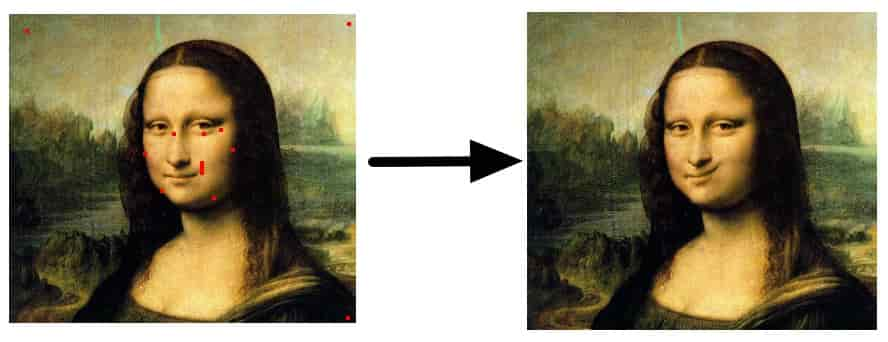
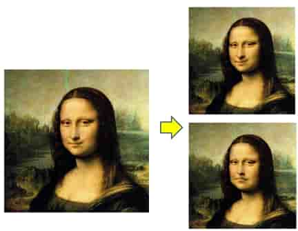

# 作业说明

> 旧版资料：https://rec.ustc.edu.cn/share/fe136800-dc93-11ee-a2ce-ad2c97024b07
>
> **只须看其 demo 目录的可执行程序及操作演示** 

## 学习过程

- 根据 [ImGui 程序框架配置说明](../../1_mini_draw/documents/framework_introduction.md) 配置作业项目代码，把 `2_ImageWarping` 项目跑通；
- 阅读 [Warping Step-by-Step](warping_step_by_step.md)，参考[CompWarping.cpp](../../../Framework2D/src/assignments/2_ImageWarping/comp_warping.cpp) 中的图像处理函数 `invert()`， `mirror()`，`gray_scale()` 等，学习基本的图像处理，然后仿照 `warping()` 函数示例实现作业中的 `IDW` 和 `RBF` 图像变形方法。我们在待实现的变形 `warping()` 处标明了 `HW2_TODO`。具体而言：
  - 为用户界面提供选点交互（可以使用框架中实现的选点交互）
  - 实现两种图像变形功能，从代码的复用性、避免解耦、数学抽象以及 C++ 面向对象编程的角度，思考：**如何对 warping 功能进行抽象和封装更加合适？**
  - 你可以直接在目录 [2_ImageWarping/](../../../Framework2D/src/assignments/2_ImageWarping/) 下添加算法需要的 `.h` 文件和 `.cpp` 文件。

## 测试图片及报告范例

- 测试例子：须用以下 [**格子图像**](../data/test.png) 来进行测试，可以很清楚看到 warping 方法的特点

- 作业实验报告范例：[示例参考](https://rec.ustc.edu.cn/share/97ce81a0-dc93-11ee-8634-cbdc421a711c) 

### 其他测试图片

- 用户交互示例如下：

- 变形效果示例如下：

## 提示

- 只须看懂英文论文中的主要思想及计算过程即可，不必追究太多背景知识及细节内容；实现基本算法即可，不必拘泥于太多细节。

- 目录不要用中文名，否则编译会出错。要习惯用英文来思考，包括代码注释等。养成使用英文的习惯！

- 务必自己独立完成该作业，做得不好没有关系，我们会指出你的问题，一步一步帮你理解该作业需要你所理解的东西，这点极其重要！只有不断从失败中改正才能有长进！我们会帮你逐步纠正错误。

