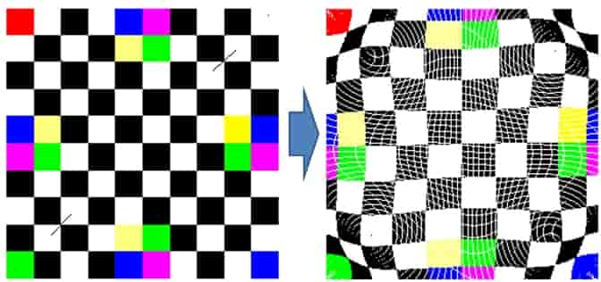

# MiniDraw Step-by-Step

## 目标和要求

- 在 [CompWarping 类](../../../Framework2D/src/assignments/2_ImageWarping/comp_warping.h) 中添加根据给定锚点对图像进行变形的功能，实现（至少）两种 warping 算法（[IDW](0_IDW.md) 和 [RBF](1_RBF.md)）；
- 在 [ImageWarping 窗口类](../../../Framework2D/src/assignments/2_ImageWarping/window_warping.h) 中添加相应的交互；
- 学习类的**继承**和**多态**，从数学抽象的角度，对你实现的 Warping 功能进行适当封装。

## 说明

- 请确保已经按照 [ImGui 程序框架配置说明](../../../Homeworks/1_mini_draw/documents/framework_introduction.md) 配置成功框架代码，这个时候应该可以运行成功 `2_ImageWarping` 项目；
- 善用 VS Code 的全局搜索功能，快捷键 `Ctrl+Shift+F`，例如你可以使用这个功能全局搜索 `HW2_TODO` 的提示，帮助快速定位到关键部分。
- **符合项目要求的结构设计、实现方法有很多，你不一定要严格按照下面的提示来实现，如果你有更好的想法，请务必实现它，并且在报告文件中详细描述。**

## 0. 面向对象编程思想

通过 [C++ 课前热身练习](../../0_cpp_warmup/) 你已经掌握了面向对象编程的基本思想（类的封装、继承、多态），其理念就是：

- **程序＝对象＋对象＋对象＋…** 

- 对象＝数据结构＋算法

这与面向过程编程（程序＝数据结构＋算法）是不一样的。

## 1. 了解图像操作

作为图像编程的入门，我们封装了一个图像类 `Image` ，其中提供获取和修改图像属性的基本操作，你可以通过阅读 `CompWarping::invert()`，`CompWarping::mirror()`中的代码，快速上手这些操作，它们分别实现了颜色反转、镜像的图像编辑，一些可能会用到的图像操作如下

```c++
int width(); // 获取宽度
int height(); // 获取高度
int channels(); // 获取通道数，例如 RGB 格式的图像是 3 通道，RGBA 格式的图像是 4 通道

// 获取 (x,y) 位置的像素值，是一个 0~255 值构成的，长度为通道数的数组
std::vector<unsigned char> get_pixel(int x, int y); 

// 设置 (x,y) 位置的像素值，需要输入一个符合通道长度的数组作为这个像素的颜色
// 经过特殊处理，4 通道的 RGBA 图像也可以输入长度为 3 的 RGB 数据 
void set_pixel(int x, int y, const std::vector<unsigned char>& values);
```

你只要看懂 `CompImage::invert()` 等函数，**模仿使用 `Image` 类中的四个函数 ( `width()`, `height()`, `get_pixel()`, `set_pixel()`)** 即可操作图像的处理。不必去看其他图像处理的书籍和知识后才来处理图像编程。建议大家通过该工程来实现一个非常简单的图像算法，比如线性方法的 `Color2Gray`。

> **注意整型和浮点型的转换**，图像操作的行列下标是整型，但是在一些操作中，只有转化为浮点型运算才能保证计算的精度。

## 2. 鼠标选点的功能

我们已经提供了一个简单的交互选点操作，它将选定的点在图像中的相对位置记录在

```c++
std::vector<ImVec2> start_points_, end_points_;
```

你可以在 `warping()` 函数中调用这些属性。

## 3. 实现 warping 操作

单击 `Warping` 按钮，会执行 `warping()` 函数，现在里面的实现是一个（正向的）“鱼眼”变形，基本逻辑是

- 初始化一个图像副本，存储变形之后的数据；
- 为每个像素点 (x, y) 计算变形之后的位置 (x', y')；
- 从原始图像的 (x, y) 位置拷贝像素颜色，添加到新图像的 (x', y') 位置
- 把新图像存储下来

你只需修改上面的第二小步：如何从选中的若干点对，计算符合这些点对的一个图像变形映射。具体而言，你需要实现两种不同的算法 [IDW](0_IDW.md) 和 [RBF](1_RBF.md)。

> 从代码的复用性和可读性考虑，**我们要求把 warping 的核心算法抽象出来封装成（若干个）类，而不是全部实现在 `CompWarping` 类里面。**
> 
> 提供的 `fisheye_warping()` 是一种 warping 操作，你将要实现的 IDW 和 RBF 算法也是一种 warping 操作。能否从我们的任务中抽象出**图像无关**的**数学变换**？
> 
> 回顾 C++ 的面向对象性质，你需要对 Image Warping 操作进行数学抽象，并设计合理的类结构和接口，在 [2_ImageWarping/](../../../Framework2D/src/assignments/2_ImageWarping/) 下添加合适的 `.h` 文件和 `.cpp` 文件，并且在 `CompWarping` 类里面调用它们。

### Eigen库

- 实现RBF方法需要求解线性方程组，你可以自己实现，也可以从网上找其他程序或库来用
- 强烈推荐使用 Eigen 库来求解线性方程组，Eigen 库是强大的数学算法库，是计算机图形学必须了解的算法库
- 我们提供了 Eigen 库的使用示例：[eigen_example](eigen_example/) 

> [eigen_example](eigen_example/) 演示的添加依赖的方式重点掌握，另外为了保证项目的简洁性，不要将依赖部分加到 git 版本管理中，使用 [.gitignore](../../../.gitignore) 忽略掉 [eigen_example/src/_deps/](eigen_example/src/_deps/) 

## 4. 补洞（optional）

结果图像中可能会出现白色空洞或条纹，你需要分析是什么原因造成的。

一种填补这些空洞的方式是利用周围的已知像素进行插值填充。这也是个**插值问题**（即利用空洞周围一定范围的已知像素来插值该像素的颜色）。你可以尝试如何用你实现的 `IDW warping` 类（或者对 `IDW warping` 类的简单改造。）来填充这些空洞像素的颜色。

<div align=center></div align>

### ANN库（Optional）

若你需要用搜索最近点的任务（在补洞的任务中），建议学习使用如下的库：

- [Annoy(Approximate Nearest Neighbors Oh Yeah)](https://github.com/spotify/annoy)

我们提供了测试项目 [ann_example](ann_example/)


