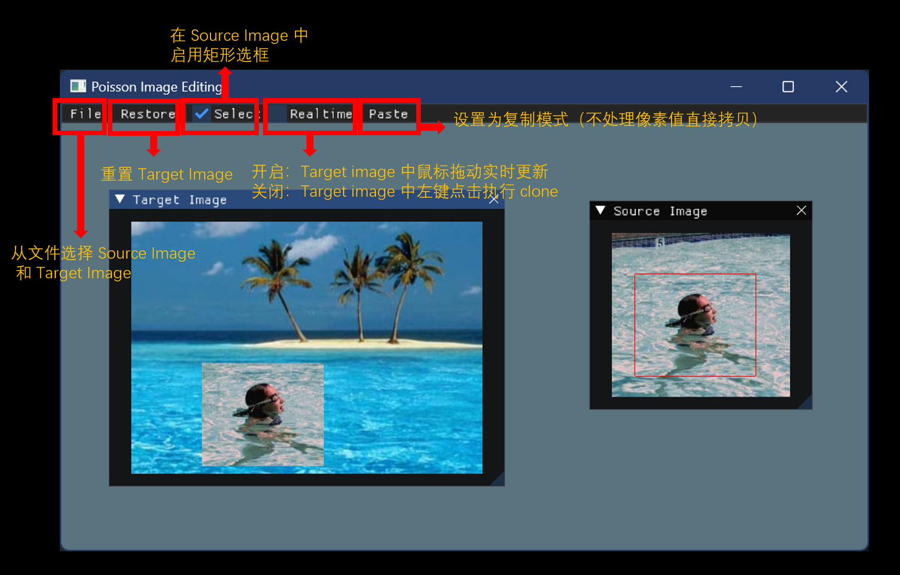
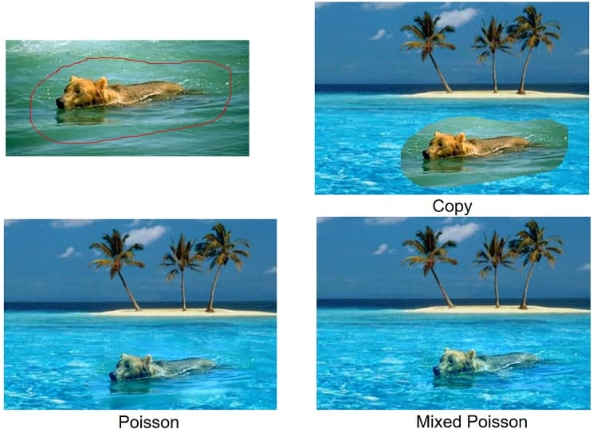

# 作业说明

## 学习过程

- 框架一样是 [Framework2D](../../../Framework2D/)，配置过程不变；
- 你需要使用到 [Eigen](../../2_image_warping/documents/eigen_example/) 库，如何配置这个库可以参考上一个作业的说明文档；
- 阅读论文 [Poisson Image Editing [Siggraph 2003]](https://www.cs.jhu.edu/~misha/Fall07/Papers/Perez03.pdf)，了解其基本算法和思想；
- 阅读 [Poisson Step-by-Step](poisson_step_by_step.md)，修改 [CompTargetImage](../../../Framework2D/src/assignments/3_PoissonImageEditing/comp_target_image.cpp) 中的 `clone()` 函数，实现 Poisson 图像融合的算法。我们已经提供了源图像矩形区域的选取功能，以及将该区域简单 `paste` 到目标图像中的实现示例。你也可以根据自己的需求添加 `*.h, *.cpp` 代码文件。可按照如下思路完成本次作业：
  - 利用框架中提供的矩形区域选取功能，实现**矩形区域的 Poisson 图像融合**（列出并求解关于像素颜色的稀疏线性方程组），至少须实现文中的Seamless Cloning的应用；
  - 学习使用 Eigen 库的**矩阵预分解**，选择**适合的**矩阵分解方法，实现鼠标拖动的**实时编辑**（打开 UI 中的 Realtime 开关）；
  - 矩形区域的**保底要求**完成后，可考虑完成**选做**内容：
    - 多边形区域的选取功能（[多边形的扫描线算法](ScanningLine.md)）
    - 多边形区域下的 Poisson 方程求解

## 交互说明

交互程序的基本界面和功能如下：

## 测试图片

### 测试图像

须用 [**测试图像**](../data/) 来进行测试；鼓励使用其他图像来测试各种应用效果（比如生成个性化的表情包）。

### 结果示例

## 资源介绍

- 进一步规范代码实现规范和习惯，继续阅读并提高 C++ 编程的技巧和经验
  - 提高 C++ 编程的 50 项技巧（[百度网盘](http://pan.baidu.com/s/1gdECTBd)）
  - 改进 C++ 程序的 6 个技巧（[百度网盘](http://pan.baidu.com/s/1ntNojhf)）
  - [Google 命名规则](http://zh-google-styleguide-fix.readthedocs.org/en/latest/google-cpp-styleguide/naming.html) 
- 如何查找文献（[百度网盘](http://pan.baidu.com/s/1o6z56T8)）
- [数学在计算机图形学中的应用](http://staff.ustc.edu.cn/~lgliu/Resources/CG/Math_for_CG_Turk_CN.htm) 

## 参考文献

[^03Perez]: Pérez P, Gangnet M, Blake A. [**Poisson image editing**](https://www.cs.jhu.edu/~misha/Fall07/Papers/Perez03.pdf), ACM Transactions on Graphics (Proc. SIGGRAPH), 22(3): 313-318, 2003. 