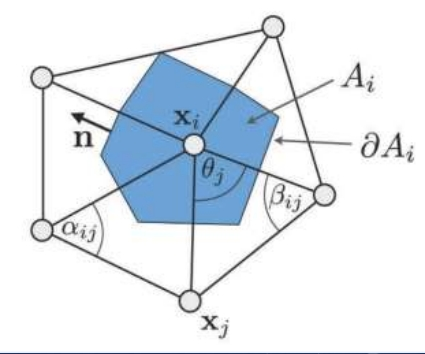

# 作业说明

## 学习过程

- 阅读 [Framework3D 框架配置说明](../../../Framework3D/README.md) 并配置框架
  - 目前没必要深入学习框架的实现，只需参考文档和样例了解 **单个** 节点 `.cpp` 文件的编写，即可轻松完成后续作业；
- 阅读 [网格数据结构](openmesh.md) 学习网格的基本表达方式，以及我们将用到的 OpenMesh 库
  - 提供了使用作业框架和半边结构计算并可视化**三角网格曲率**的示例；
  - 学习如何通过半边结构**遍历**顶点、面、边以及访问他们的**邻域**等；
- 参考论文和[作业要求](https://rec.ustc.edu.cn/share/c55d42a0-bfcd-11ee-b7db-eb3ed86abde8)实现 Tutte 曲面参数化算法。你可以在[指定目录](../../../Framework3D/source/nodes/nodes/geometry/)下为算法添加节点实现，在框架中测试算法的正确性以及不同变量选取对实验结果的影响。可按照如下思路完成本次作业：
  - 实现网格上（均匀权重） **Laplace方程的建立和求解**，边界条件仍然选取为原来的空间点位置，可以求解得到固定边界下的"**极小曲面**"，完成 [极小曲面节点](../../../Framework3D/source/nodes/nodes/geometry/node_min_surf.cpp)；
  - 在同样系数下，修改边界条件，将网格**边界映射到平面凸区域的边界**（正方形、圆形），完成 [边界映射节点](../../../Framework3D/source/nodes/nodes/geometry/node_boundary_mapping.cpp)；
  - 求解得到（均匀权重的）**Tutte 参数化** （连接以上两个节点！）
  - 使用**纹理映射节点**可视化参数坐标；
  - 尝试并比较不同的**权重**选取，例如
    - Cotangent weights （需要实现）
    - (Optional) shape-preserving weights (Floater weights)。
- **Note**: 
  - 你可以根据需求任意添加节点，或者给节点增加额外的输入、输出；
  - 鼓励对实现的算法进行类的封装。

## 测试网格

我们提供了若干具有一条边界的**三角网格**，见 [data/](../data/) 目录，它们的表达格式是 Universal Scene Description (USD)，参考[网格数据说明](../data/README.md)。也可以访问[课程资料网盘下载](https://rec.ustc.edu.cn/share/c55d42a0-bfcd-11ee-b7db-eb3ed86abde8)。

## 测试纹理

可以使用 [测试纹理](../data/test.png) 对参数化网格进行纹理贴图，检验并测试参数化的结果。

## 参考公式

#### 顶点的微分坐标

$$ \boldsymbol\delta _ i = \boldsymbol{v _ i} - \sum _ {j \in N(i)} w _ j  \boldsymbol{v _ j},$$

其中 $N(i)$ 表示顶点 $i$ 的 1-邻域.

#### 权重选取

- Uniform weights: $w _ j = 1$;
- Cotangent weights: $w _ j = \cot \alpha _ {ij} + \cot \beta _ {ij}$（注意和原网格的几何有关）;
- Floater's shape-preserving weights (optional): 参考 [Floater1997](https://www.cs.jhu.edu/~misha/Fall09/Floater97.pdf)； 
- 归一化处理 :
  
$$ w _ j = \frac{w _ j}{\displaystyle \sum_k w_k }.$$

#### （均匀权重下的）极小曲面计算

固定边界点坐标，取均匀权重下的 $\boldsymbol{\delta} _ i = \boldsymbol{0}$ 即

$$ \frac{1}{d _ i} \sum _ {j\in N(i)} (\boldsymbol{v} _ i - \boldsymbol{v} _ j) = \boldsymbol{0}, \quad \text{for all interior } i .$$

主要步骤：
- 检测边界
- 固定边界
- 构建稀疏方程组
- 求解稀疏方程组
- 更新顶点坐标

思考：高亏格曲面？

#### Tutte 参数化计算

分布边界点的坐标到平面凸区域的边界，求解同样的方程组：

$$ \boldsymbol{v _ i} - \sum _ {j \in N(i)} w _ j  \boldsymbol{v _ j} = \boldsymbol{0}, \quad \text{for all interior } i .$$

主要步骤：
- 检测边界
- **将边界映射到正方形或圆形边界**
- 构建稀疏方程组
- 求解稀疏方程组
- 更新顶点坐标
- **连接纹理图像，并更新显示**（最好将纹理坐标归一化）