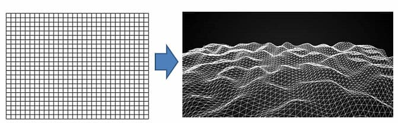
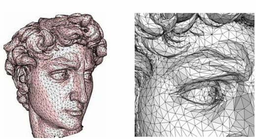
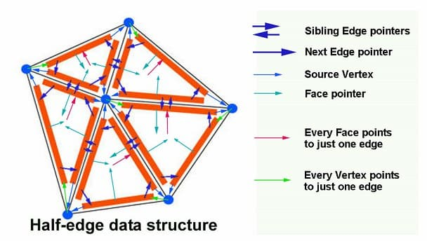
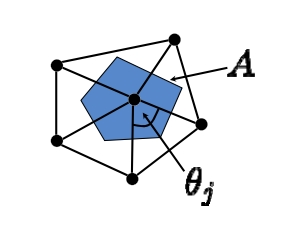

# 网格数据结构

## 1. 基础知识

### 3D 网格曲面

3D 网格曲面是2D流形曲面的离散形式。本质上是 2D 三角网格的顶点映射(lift)到 3D 中：

<div align=center></div align>

### 顶点的连接关系

<div align=center></div align>


### 存储数据结构：半边结构

<div align=center></div align>

我们将会用到半边结构来实现网格处理算法。在半边结构中，网格被额外添加了 Halfedge 的数据结构，它记录相邻顶点（`from()`, `to()`）、相邻半边（`next()`, `opposite()` 等）、相邻面的索引（没有相邻的面，即为边界），从而可以方便地实现网格数据的操作。

相关资料：
- [Half-edge structure by Kalle Rutanen](https://kaba.hilvi.org/homepage/blog/halfedge/halfedge.htm)
- [Half-Edge Data Structures by Jerry Yin and Jeffrey Goh](https://jerryyin.info/geometry-processing-algorithms/half-edge/) 

## 2. 半边数据结构的处理

本次作业使用 [OpenMesh](https://www.graphics.rwth-aachen.de/software/openmesh/) 实现半边数据结构的处理。通过半边数据结构，我们可以方便地进行如下操作：

- 访问和遍历网格的顶点、面、边
- 访问一个顶点、面、边的邻域信息
- 网格拓扑变化（顶点、面的增删等）

## 3. 参考示例

我们在项目中提供了一个 [半边结构的操作示例](../../../Framework3D/source/nodes/nodes/geometry/node_curvature.cpp)，可以参考其中的操作学习 OpenMesh 的基本使用方法。

该节点的目标是计算三角网格每个顶点 $v$ 处的 Gauss 曲率，使用公式：

$$
K_v = \frac{1}{A_v} \left(2\pi - \sum_{j}\theta_j\right)
$$

<div align=center></div align>

这里的 $\theta_i$ 如图所示，$A_v$ 是顶点周边邻域的面积，这里取每个三角形三分之一的面积和。

为了实现这个计算，我们需要如下的操作：

- 遍历所有的顶点，访问顶点的三维坐标
- 从一个顶点出发，遍历周围相邻的边结构和面结构

对于这些遍历操作，OpenMesh 提供了较为方便的迭代器，它们大部分本质上都是依靠半边数据结构来实现的。例如在上面的例子中我们实际上用到了：

### 遍历一个顶点的 1-邻域

（逆时针）遍历一个顶点的 1-邻域可以通过半边结构实现：

- 首先获取顶点连接的 **一条** 半边 `he = v.halfedge`
- 从这个半边出发，逆时针方向的 **下一条** 半边为 `he.prev().opp()`

整个遍历可以通过一个 `do...while` 循环来实现

```cpp
start = v.halfedge
he = start
do {
    // Visit the halfedge
    he = he.prev().opp()
} while (he != start)
```

其他的遍历方式，例如遍历一个面相邻的所有边等，既可以用 OpenMesh 提供的迭代器，也都可以通过半边结构实现

### 遍历一个面相邻的半边

```cpp
start = f.halfedge
he = start
do {
    // Visit the halfedge
    he = he.next()
} while (he != start)
```

### 遍历网格的边界

在我们的作业中，需要执行遍历网格的一条**边界**的操作，可惜OpenMesh 似乎并没有提供直接遍历边界的迭代器，需要自己实现。但事实上，其于遍历一个面相邻的边的操作是类似的（为什么）。

你需要通过实现一个边界遍历的操作，实现将网格的边界映射到平面凸区域的边界上。

### 网格的拓扑编辑

本次作业只涉及网格属性的遍历和访问，在后续作业中，我们将会涉及更多的半边结构操作，例如更改网格的拓扑（顶点、面的增删等）。


