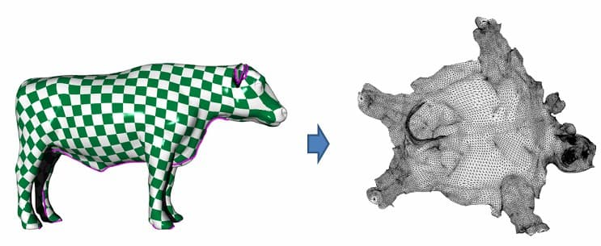
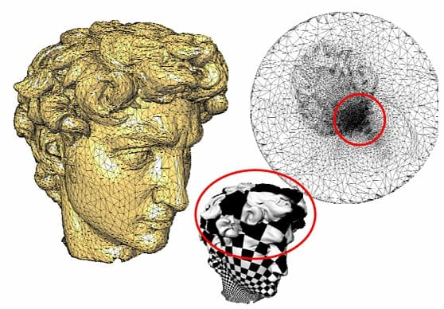
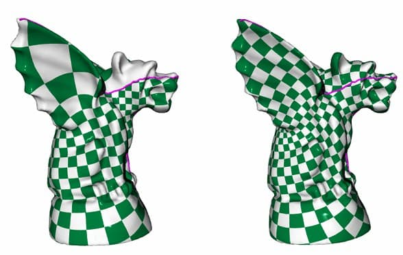
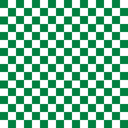
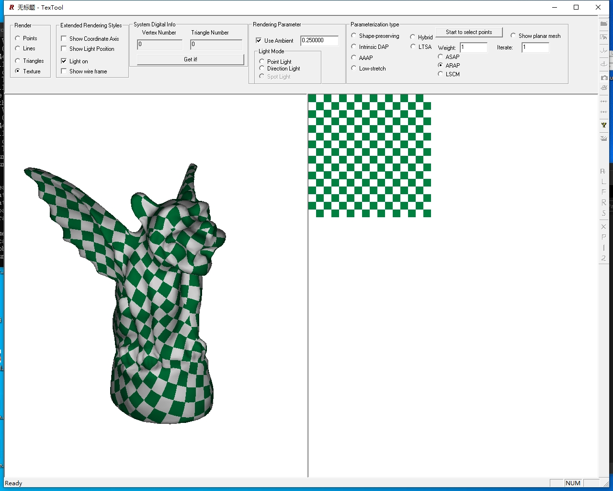
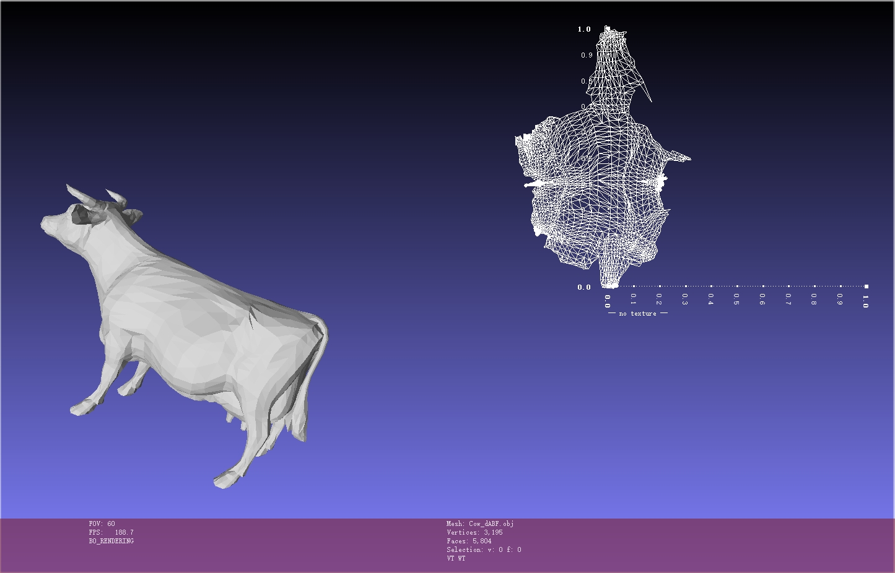
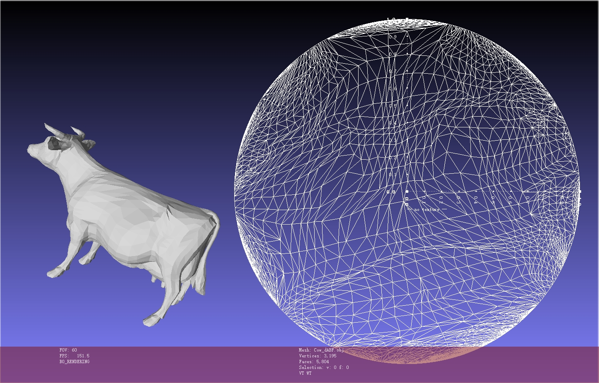

# 作业说明

实现 SGP 2008 的 ARAP (As-rigid-as-possible) 参数化算法。

## 问题背景

### 线性参数化方法

作业 4 中的参数化方法是将边界进行固定，能保持 valid (flip-free) 的参数化结果，但是三角形的形变较大。

> 思考：三角形的形变量度量？

### 非线性参数化方法

如果不固定边界，边界的点也有自由度进行移动，能减小三角形的形变量，从而得到更好的参数化结果。

## 学习过程

- 通过作业4 我们已经 [配置好了框架](../../../Framework3D/README.md)，并且学会了节点文件的编写和 [网格数据结构](../../4_tutte_parametrzation/documents/openmesh.md) 的基本操作。本次作业继续沿用作业 4 的形式，你只需要在[指定目录](../../../Framework3D/source/nodes/nodes/geometry/)下为添加节点实现，组合现有的节点，实现[参考论文](https://cs.harvard.edu/~sjg/papers/arap.pdf)中的 ARAP 参数化算法，它对应一个未实现的[ARAP 参数化节点](../../../Framework3D/source/nodes/nodes/geometry/node_arap.cpp)。

- 可阅读论文和课件，按照如下思路完成本次作业：
  - **Step 1:** 实现一个**初始参数化**。
    - 这一步可以使用你在作业 4 中实现的任何一种参数化结果。
  - **Step 2:** 实现 ARAP 的**局部迭代步骤（Local Phase）**。
    - 在每个三角形 $t$ 上独立执行，相对简单
    - 实现一个二阶矩阵的 SVD 分解
    - 固定参数坐标 $u$，计算当前参数化 Jacobian $\boldsymbol{J} _ t$ 的局部正交逼近 $\boldsymbol{L} _ t$
  - **Step 3:** 实现 ARAP 的**全局迭代步骤（Global Phase）**。
    - 固定每个三角形上的 $\boldsymbol{L}_t$ ，更新参数坐标 $u$
    - 求解一个全局的稀疏线性方程组
    - 方程组的系数固定不变，只需要设置一次并**预分解**
  -  **Step 4:** 迭代若干次观察结果。
-  （Optional）论文中还介绍了相关的两种参数化算法：
   -  **ASAP：** 直接求解一个全局的稀疏方程组，同时确定参数化坐标 $u$ 和辅助（保角）矩阵 $L$；
   -  **Hybrid Model：** 通过一个参数 $\lambda\in[0, \infty)$ 控制参数化结果在 ARAP 和 ASAP 之间变化，可通过 Local/Global 方法求解。
- **Note**: 
  - ARAP 的全局迭代步骤，以及 ASAP 的稀疏方程组求解都要**额外提供若干固定点**信息，你需要判断固定点的个数以及选取方式，并思考背后的原因；
  - 你可以根据需求任意添加节点，或者给节点增加额外的输入、输出；
  - 鼓励对实现的算法进行类的封装。

## 测试网格

补充提供了若干具有一条边界的**三角网格**，见 [data/](../data/) 目录，它们的表达格式是 Universal Scene Description (USD)，参考[网格数据说明](../../4_tutte_parametrzation/data/README.md)。也可以访问[课程资料网盘下载](https://rec.ustc.edu.cn/share/c55d42a0-bfcd-11ee-b7db-eb3ed86abde8)。

## 测试纹理

可以使用 [测试纹理](../data/green_checkerboard.png) 对参数化网格进行纹理贴图，检验并测试参数化的结果。

## 补充材料

### Demo 程序

在[课程资料](https://rec.ustc.edu.cn/share/c55d42a0-bfcd-11ee-b7db-eb3ed86abde8) 中有论文的 Demo 程序，可以自行尝试运行，内含配置和使用说明。

### MeshLab

[MeshLab](https://www.meshlab.net/) 是一个开源的3D几何处理框架。它可以用来查看多种 3D 数据，也内置有大量经典的几何处理算法。例如可以使用它来进行网格参数化：

#### LSCM (Least Squares Conformal Maps) (Equivalent to ASAP)

#### Harmonic Parameterization

