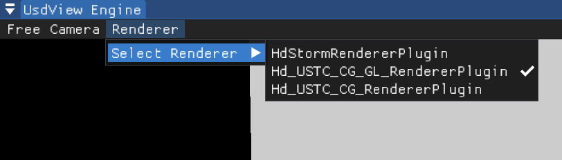
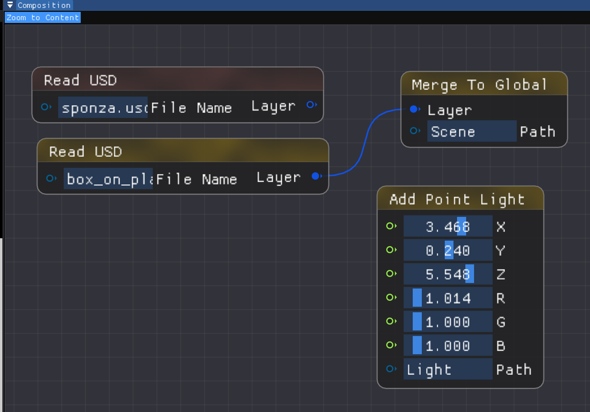
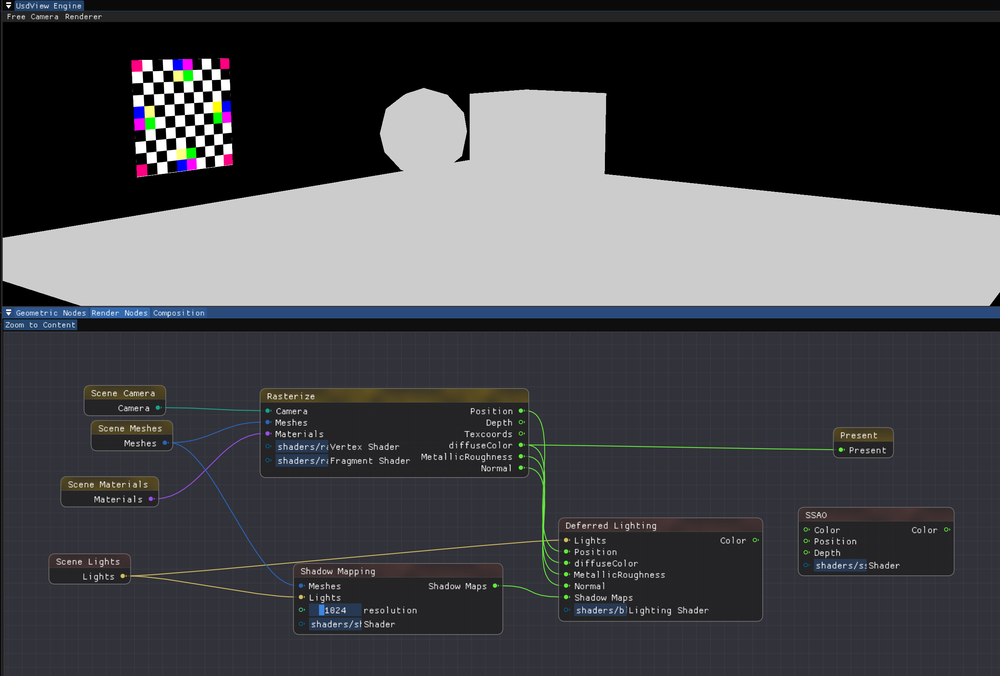
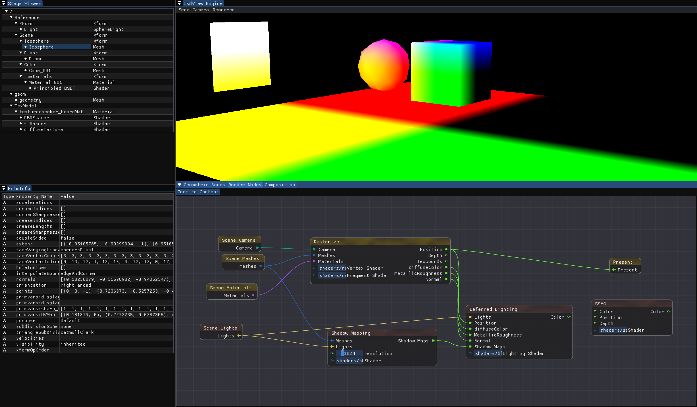

# 新功能

## Renderer Selection

可对Renderer进行切换。本次作业我们使用中间的渲染器，可由后文所述的节点图进行控制。先前作业我们使用了第一个Plugin，下一次的路径追踪我们会修改最下方的渲染器。

## Composition Graph

可直接导入一整个USD文件，并加入了基础的灯光控制。

## Render Graph

渲染流程由节点进行控制。

## 状态栏

可对当前场景的所有元素进行观察。