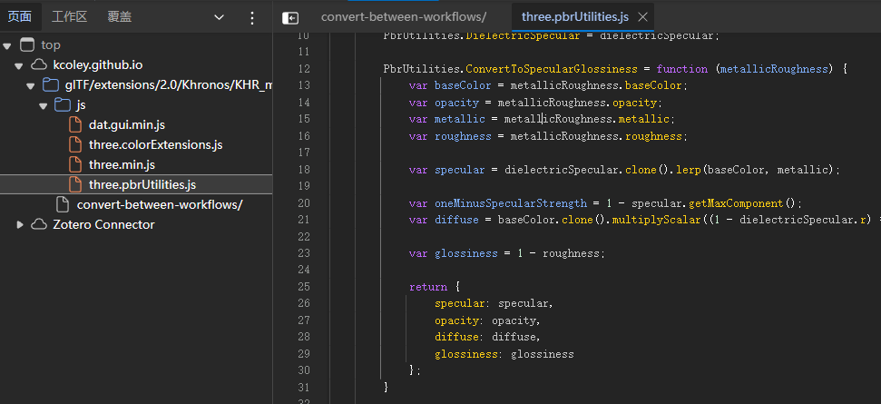
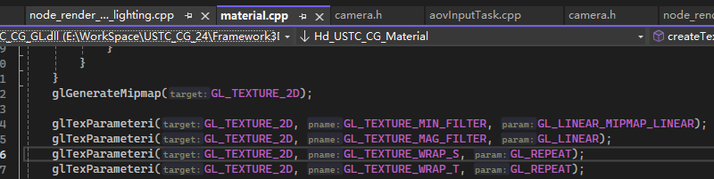

# Q&A
## 什么是metallic 和 roughness？

这个和上课介绍的可能有点出入，但此次同学们在本次作业中可以对此进行简单处理：

- ks = metallic*0.8
- kd = 1-ks
- blinn-phong中的指数 = (1-roughness)*某个常数
- ka = 某个你喜欢的常数

调整这些常数都不需要重新编译，只需保存shader即可看到结果的变化，因此可以快速迭代。

在这个链接（[specular-roughness工作流转换](https://kcoley.github.io/glTF/extensions/2.0/Khronos/KHR_materials_pbrSpecularGlossiness/examples/convert-between-workflows/)）的源代码（在网页上按F12进入）中，有一份标准的转换方式。




## 为什么我的图像看起来有点糊？尤其是从斜视表面的视角进行观察时？


我们使用了OpenGL内置的Mipmap，它会对图像进行预滤波。关于Mipmap以及为什么要使用它，请查看[这里](https://learnopengl-cn.github.io/01%20Getting%20started/06%20Textures/)。

感兴趣的同学可以去掉 `glGenerateMipmap(GL_TEXTURE_2D);`，并将`GL_LINEAR_MIPMAP_LINEAR`更改为`GL_LINEAR`观察效果。

为了不出现模糊，我们需要使用所用的各向异性过滤，对纹理的两个方向使用不同的Mipmap等级。

```C++
    float aniso = 0.0f;
    glGetFloatv(GL_MAX_TEXTURE_MAX_ANISOTROPY_EXT, &aniso);
    glTexParameterf(GL_TEXTURE_2D, GL_TEXTURE_MAX_ANISOTROPY_EXT, aniso);
```

但由于这是扩展特性，我们默认不开启。但大部分同学的显卡应该都会支持，可以解除注释进行尝试。