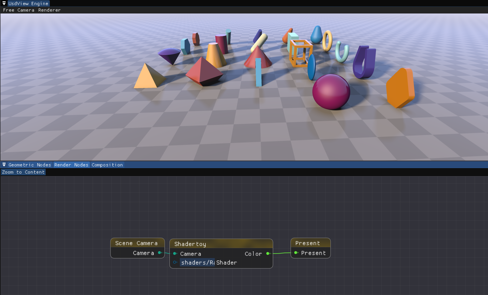

# Shader编程

欢迎来到GPU编程的世界！

GPGPU被广泛使用在各种任务中，是目前火热的人工智能领域最重要的硬件资源。在本次作业中，我么会利用GPU最开始设计出来的目的——图形计算。

## 本次作业

我们需要完成：

### Blinn Phong着色模型
1. 首先连接节点Rasterize的输出，观察不同连接的结果。
2. 在Lighting节点中，按注释完成 blinn_phong.fs
3. 在rasterize.fs中，读取法线贴图并且完成法线贴图映射。（本步骤可以后执行）

### Shadow Mapping
1. 创建Shadow Mapping节点
2. 修改或是拷贝一份 rasterize_impl.fs，在其中完成Shadow Mapping。这里你需要在C++文件中填写更多信息，需要对光源出发的矩阵进行填写（与计算shadow mapping时使用的一致即可）

### PCSS (Optional)
1. 修改或拷贝一份blinn-phong.fs，按注释和参考资料完成PCSS。
### SSAO (Optional)
1. 创建SSAO节点，读取深度和光照的结果

还有一种效果更好的的算法，称为HBAO，我们提供的节点接口足以支撑这种算法，感兴趣的同学可以尝试实现。

## 框架配置

本次框架更新了一批功能，但配置流程保持不变，即拉取后重新cmake并配置即可。如出现本地自己先前完成的节点无法运行的情况可以联系助教。

更新后可能有一些窗口藏在后面，可以使用shift+tab将其切换到前方，然后进行缩放或贴靠，也可以将已有的窗口挪开，找到新窗口进行贴靠。

可使用此节点图来进行测试是否配置良好：

注意这是Render Nodes节点图，并且不能挪动相机是正常的。

本次框架提供的新功能[在此](./NewFeatures.md)介绍。

## 测试场景

可以使用Composition图来加载测试数据。（测试数据见[根目录文档](../README.md)）。

## 小技巧
- 节点大多数可以动态替换shader文件的路径，因此可以创建同名但调用不同shader的节点，便于比较结果。
- 如果只修改了shader，不用退出再重新打开，只需对shader进行保存即可在程序中看到更新后的结果。

## 限制

- 本次作业对点光源进行shadow mapping，但目前的shadow贴图只使用了单张而不是cubemap对场景进行观察，因此没有办法向四面八方进行投影。感兴趣的同学可以对此改进。
- 可以加入方向光源的支持。
- 目前Composition图在删除节点时无法直接清除掉场景的物体，只能进行覆写，或重新打开系统后更新。（后续会对断开节点的行为加入CallBack，目前这样设置是为了提高挪动光源时的效率。）

## OpenGL

**图形API：** 我们需要通过图形API来与GPU交换信息。GPU计算的输入输出都会通过图形API来在内存和显存之间传递。

OpenGL是目前广泛使用的一种图形API。由于它诞生较早，近些年发展不是非常激进，因此它具备的一个优势是支持最为广泛，可以认为几乎所有的GPU都会对OpenGL有比较完善的支持。它的另一个优势是逻辑较为简单，适合初学者上手。

## Shader

Shader是一段在GPU上执行的代码。

Shader有多种类型。最早发展的是顶点着色器（Vertex Shader）和面元着色器（Fragment Shader）。它们构成的管线能够读取顶点的描述信息，将读取的结果进行光栅化，并且进行着色。

## 现代图形API

除了OpenGL，我们通常所说的现代图形API还包括DirectX 12以及Vulkan。此类API相比OpenGL主要的区别在于执行流程的改变。OpenGL是一个全局的状态机模型。在使用时我们的每一个指令都需要进行“绑定”的操作，每一个操作都需要在CPU和GPU之间进行同步，即CPU侧发出指令，GPU侧进行计算，完成后将结果反馈给CPU，CPU再执行下一个指令。此过程相当低效，并且严重阻碍了在渲染使用多线程调用图形API（设想我们有数十万个动态小模型需要渲染）。

Vulkan和DirectX都有非常清晰的异构执行模型。用户来进行一系列指令的录制，录制后将结果提交给

Apple推出了Matal图形API。感兴趣的同学可以查找关于此API的相关资料。
