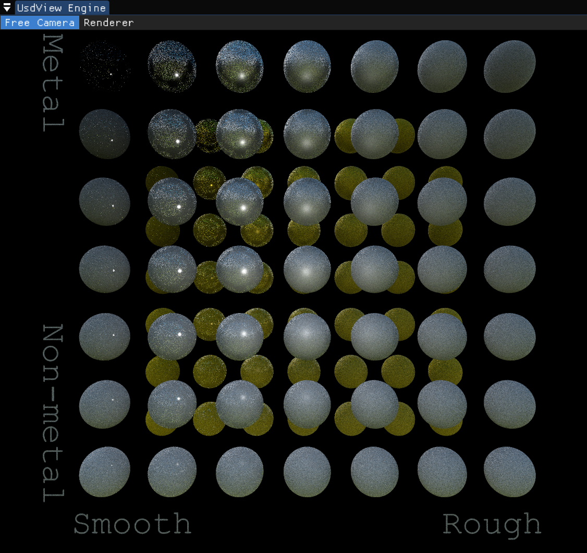
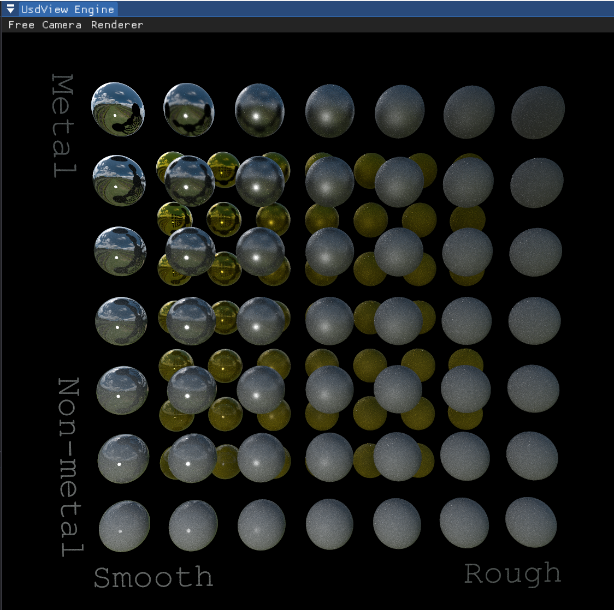
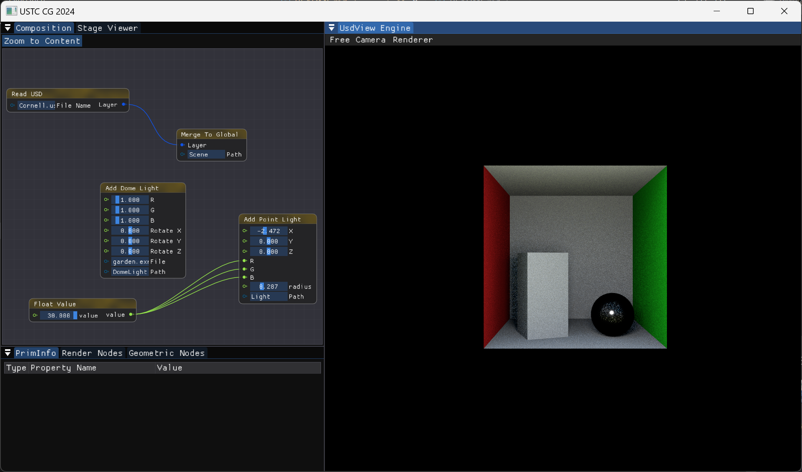
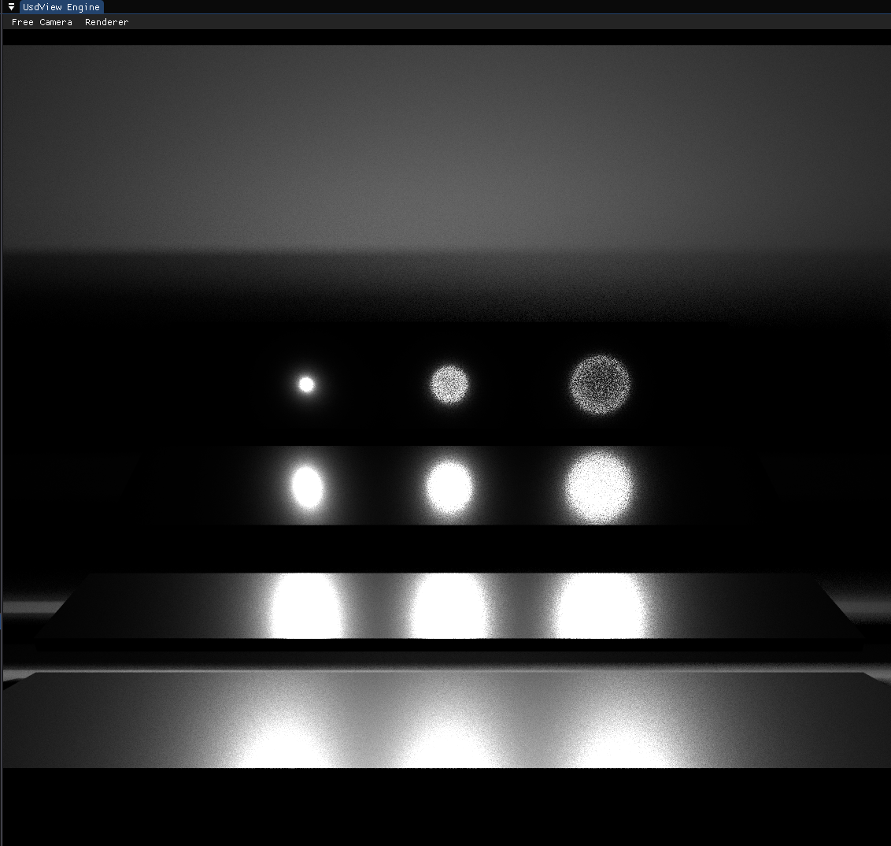
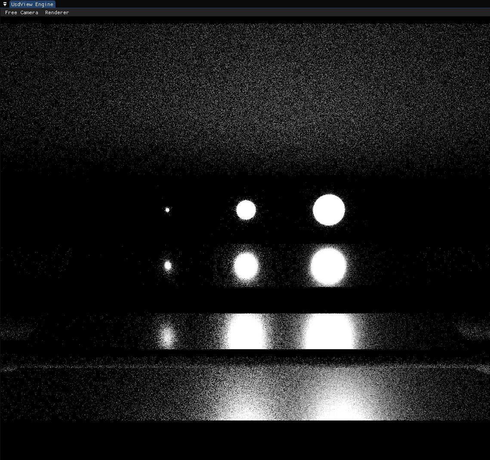
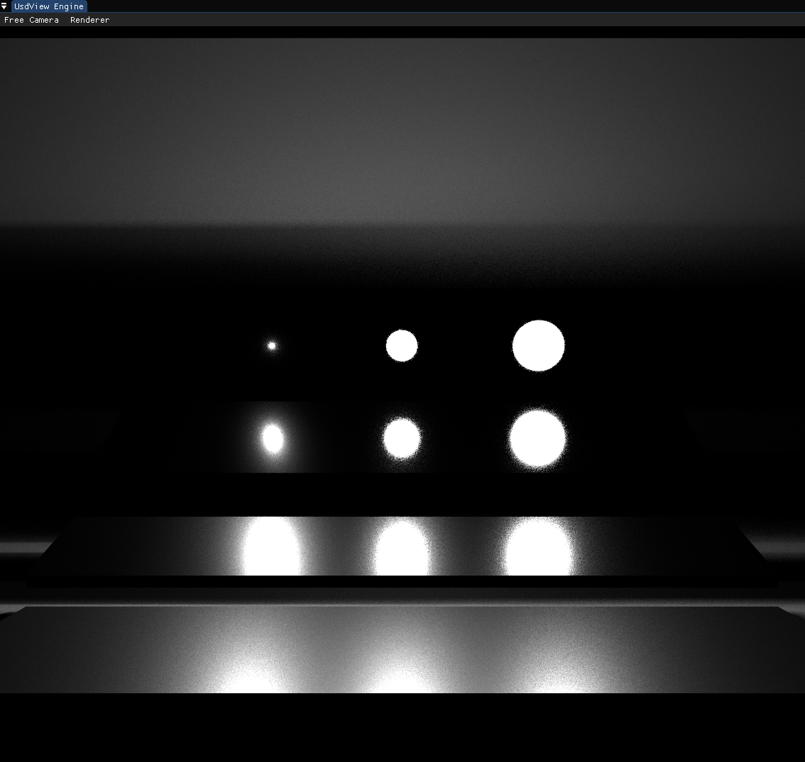

# Document

遇到问题可以查看[Q&A](./QA.md)。

## 作业步骤

### 实现直接光照积分器

初始状态下，我们能得到当前结果：

事实上，我们已经完成了直接光照积分器的实现。本部分作业需要额外对一种光源实现支持，即`Hd_USTC_CG_Rect_Light`。它位于Light.h/Light.cpp的最末尾，同学们需要参考同文件中的Sphere Light完成其中的几个函数。

### 路径追踪算法

我们可以在这里，将其中的`DirectLightIntegrator`切换为`PathIntegrator`来开始下一步的实现。

此部分需按照课上所讲内容，实现`EstimateOutGoingRadiance`函数。如果一切顺利，同学们会看到：

可以实现Russian Roullete来提高采样器的效率。需注意效率和低方差并不等价，事实上RR会增大采样的方差。

### 添加材质

同学们有两种选择。第一种是参考[Raytracing in One weekend](https://raytracing.github.io/books/RayTracingInOneWeekend.html#metal/mirroredlightreflection)中的方式来添加材质。它提供的方案在视觉观感上足够好，同时也能够参与到重要性采样中，但在物理正确性上则没有很好的保证，同时也有透明的材质。

另一种方案是使用标准的微表面模型材质，比如对于金属常用的GGX Model等。此种方案较为复杂，难以将结果调对，建议留到最后考虑。

## 多重重要性采样

为了帮助同学们实现多重重要性采样，我们在分支 microfacet 中提供了微表面模型的材质。在未实现多重重要性采样时，在直接光照下我们会看到：

在正确实现多重重要性采样后，能够看到

注意，切换到microfacet分支后，

Cornell的光滑金属球在没有多重重要性采样的情况下，环境光照部分也会有很多噪点。

在MIS.usda例子中，对光源进行采样：

对BRDF进行采样：

多重重要性采样：
