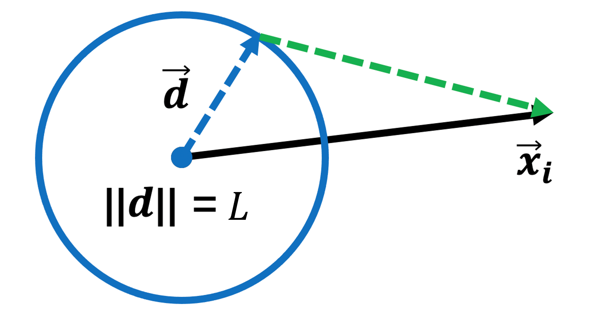
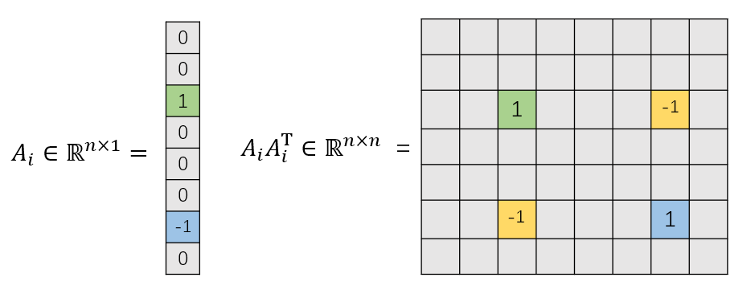
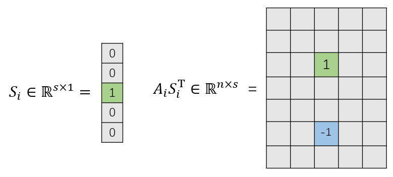
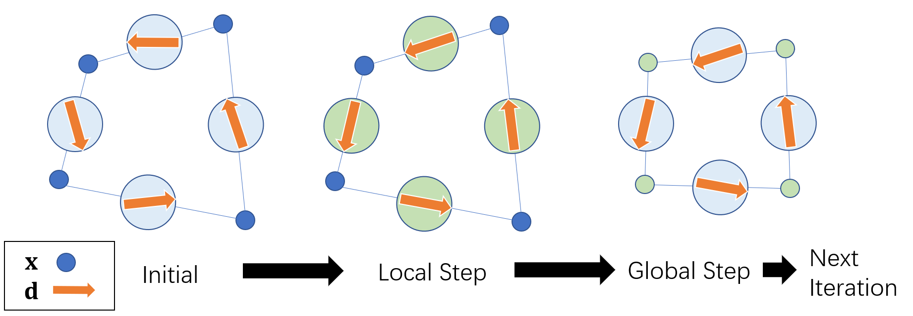
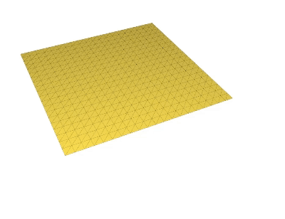
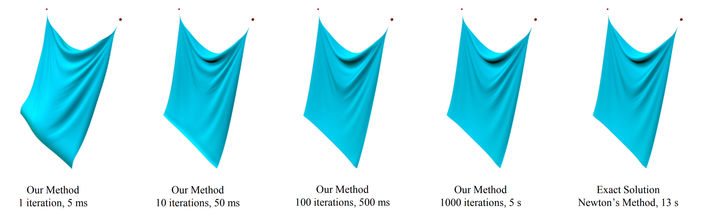
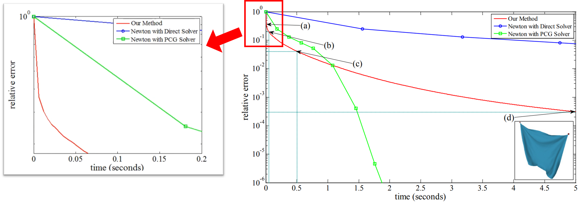

# 弹簧质点系统仿真简明教程 Part 2 之加速方法

如果你已经完成了Part 1，那么欢迎你来到弹簧质点系统仿真的进阶教程。我们将介绍刘天添老师在论文[Fast Simulation of Mass-Spring Systems](https://tiantianliu.cn/papers/liu13fast/liu13fast.pdf)中提出的加速方法，并解释论文中公式的含义。

> 用>包裹的引用格式为扩展阅读内容。为了实现作业可以不看

## 1. 弹性能量的新视角

在Part 1中我们说过，弹簧质点系统中每一根弹簧的能量可以定义为（Liu的论文中使用$\mathbf{p}$表示顶点位置）:

$$
E_i = \frac{1}{2} k (\|\mathbf{x}_{i}\| -L)^2  \tag{1}
$$

其中 $\mathbf{x}_i = \mathbf{x} _{i1} - \mathbf{x} _{i2}$ 。总的弹性能为 $E = \sum_i E_i$ ，这是一个非凸的能量。

对于(1)式中的能量，我们之前看待的角度为：给定原长为 $L_i$ 的弹簧，让 $\mathbf{x}_i$ 变化，不同的 $\mathbf{x}_i$ 带来了不同的能量。 $\mathbf{x}_i$ 具有旋转的自由度，只要其范数 $= L_i$ 即可最小化能量。

但是Liu等人提出，我们可以从另一个角度看待这个能量：如果固定 $\mathbf{x}_ i$ ，让弹簧原始的长度与方向变化，也就是把弹簧表示为一个向量 $\mathbf{d}$ ，那么 $(\|\mathbf{x} _ {i}\| - L)^2$ 可以被看作是一个优化问题的解： $\min_{\| \mathbf{d}\| =r}\| \mathbf{x}_{i} - \mathbf{d}  \|^2$ 。 通过“三角形两边之差一定小于第三边”的原理我们可以容易地证明这一点，如下图所示。

<div  align="center">    
 
</div>

那么， 通过将单根弹簧的能量写为包含  $\mathbf{x}_ i$   与 $\mathbf{d }_ i$  两个变量的函数  $E _ i = \frac{1}{2} k \|\mathbf{x} _ {i} -\mathbf{d} _ i\|^2$  , 总能量可以写为：

$$
E = \sum_i E_i = \frac{1}{2} \sum_i k_i \|\mathbf{x}_i - \mathbf{d}_i \|^2 \tag{2}
$$

将二范数展开： $\|\mathbf{x}_i - \mathbf{d}_i \|^2  = (\mathbf{x}_i - \mathbf{d}_i)^\top (\mathbf{x}_i - \mathbf{d}_i )$ , 可以将公式(2)整理为矩阵相乘的形式（建议也自己推导一下）：

$$
E = \frac{1}{2} \mathbf{x}^\top \mathbf{L}\mathbf{x} - \mathbf{x}^\top \mathbf{J} \mathbf{d}  \tag{3}
$$

其中 $\mathbf{L} \in \mathbb{R}^{3n\times 3n}, \mathbf{J} \in \mathbb{R}^{3n \times 3s}$ ,  $n$ 为顶点个数， $s$ 为弹簧个数（边的个数）,  $\mathbf{d} \in \mathbb{R}^{3s \times 1}$ 为所有 $\mathbf{d}_i$按顺序拼起来的长向量 ：

$$
\mathbf{L}=\left(\sum_{i=1}^s k_i \mathbf{A} _ i \mathbf{A} _ i^{\top}\right) \otimes \mathbf{I} _ 3, \\
\mathbf{J}=\left(\sum_{i=1}^s k_i \mathbf{A}_i \mathbf{S}_i^{\top}\right) \otimes \mathbf{I}_3
$$

其中  $\mathbf{A}_i \in \mathbb{R}^{n}$ 为" the incidence vector of i-th spring"， $\mathbf{S}_i \in \mathbf{R}^{s}$ 为"the
i-th spring indicator"，它们的构建如下所示：

<div  align="center">    
 
</div>


<div  align="center">    
 
</div>

并且由于 $\mathbf{L}$ 只和弹簧的连接关系有关系（即mesh的拓扑），如果整个仿真过程中连接关系不变（如果不仿真断裂，则不会变），则 $\mathbf{L}$ 只需要算一次（很快会看到是非常好的性质）。

Ok, 现在通过引入新的变量 $\mathbf{d}$ ，我们将之前(1)式中简单的弹性能变成了(3)这种看似更加复杂形式，这样子到底有什么好处呢？下一节就会很快看到。

## 2. 双向奔赴的Local-Global Solver

上一节我们给出了新视角下的弹簧能量，结合Part 1中对隐式欧拉积分能量的介绍，

> Reminder：每一步优化的能量为：
> 
> $$
> \min_{\mathbf{x}} \quad g(\mathbf{x}) = \frac{1}{2 h^2}(\mathbf{x} - \mathbf{y})^\top   \mathbf{M} (\mathbf{x} - \mathbf{y}) + E(\mathbf{x}) 
> $$ 
> 
> 其中 $E$ 为弹性能。

那么，我们需要优化的总能量为（建议也自己推导一下）：

$$
\begin{align}
\min_{\mathbf{x}, \mathbf{d}} g(\mathbf{x}) &= \min_{\mathbf{x}, \mathbf{d}} \frac{1}{2 h^2}(\mathbf{x} - \mathbf{y})^\top   \mathbf{M} (\mathbf{x} - \mathbf{y}) + \frac{1}{2} \mathbf{x}^{\boldsymbol{\top}} \mathbf{L} \mathbf{x}-\mathbf{x}^{\top} \mathbf{J} \mathbf{d} \\
&= \min_{\mathbf{x}, \mathbf{d}} \frac{1}{2 h^2} \mathbf{x}^\top(\mathbf{M} + h^2 \mathbf{L})\mathbf{x} - \mathbf{x}^\top(\mathbf{J}\mathbf{d} + \frac{1}{h^2}\mathbf{M}\mathbf{y}) + C
\end{align}
$$

其中 $C$是与优化变量无关的常数， 由于是一个最优化问题，我们可以舍去系数，最后要优化的问题为：

$$
\min_{\mathbf{x}, \mathbf{d}} g(\mathbf{x}) =\min_{\mathbf{x}, \mathbf{d}} \quad \frac{1}{2}\mathbf{x}^\top(\mathbf{M} + h^2 \mathbf{L})\mathbf{x} - \mathbf{x}^\top(h^2 \mathbf{J}\mathbf{d} + \mathbf{M}\mathbf{y}) \tag{4}
$$

由于引入了新的变量，那么为我们带来了新的求解这个优化问题的新思路：之前是单向调整 $\mathbf{x}$ ，现在可以让 $\mathbf{x}$ 和 $\mathbf{d}$ 从两个方向“双向奔赴”，和ARAP参数化原理十分类似！

> Local-Global可以看做是一种最优化中的交替方向迭代方法。

那么在实际中，我们就先固定 $\mathbf{x}_i$ ，对每根弹簧求解 $\mathbf{d}_i$ （Local Step），这个操作非常简单，可以并行：

$$ \mathbf{d}_i = L_i \frac{\mathbf{x}_i}{\|\mathbf{x}_i \|} $$

然后再固定 $\mathbf{d}_i$ , 求解 $\mathbf{x}_i$ 。优化(4)式的能量等价于对其求导数（一阶最优条件）然后令导数=0，这一过程会转化为下面这个线性方程组的求解（Global Step）：

$$
\mathbf{A} \mathbf{x} = \mathbf{b}
$$

其中 $\mathbf{A} = \mathbf{M} + h^2 \mathbf{L} \in \mathbb{R}^{3n \times 3n}$ 以及 $\mathbf{b} = h^2 \mathbf{Jd} + \mathbf{My}\in \mathbb{R}^{3n}$, $\mathbf{x} \in \mathbb{R}^{3n}$. 

这里我们就会发现 $\mathbf{A}$ 为正定的，并且在弹簧系统拓扑不变的情况下， $\mathbf{A}$ 也不会变，所以只需要在仿真一开始计算一次！因此我们可以对 $\mathbf{A}$ 进行预分解，然后每次迭代只需要更新 $\mathbf{b}$ ，然后不断调用预分解好的求解器计算即可！这就是该加速方法最为核心的地方。

并且本质上， $\mathbf{A} = \mathbf{M} + h^2 \mathbf{L}$ 是对系统能量的 Hessian矩阵的一种近似，其中 $\mathbf{L}$ 是系统的拉普拉斯（Laplacian）矩阵。

整个方法的流程示意图如下：

<div  align="center">    
 
</div>


在本次作业中，你需要完成的是`FastMassSpring`类中构造函数中的 $\mathbf{A}$ 的计算与预分解：

```C++ 
FastMassSpring::FastMassSpring(const Eigen::MatrixXd& X, const EdgeSet& E) : MassSpring(X, E)
{
    unsigned n_vertices = X.rows();
    Eigen::SparseMatrix<double> A(n_vertices * 3, n_vertices * 3);
    A.setZero();
    // ... 
    // compute A here

    A.makeCompressed();
    // Prefactorize A here 
}
```

和`step`函数: 

```C++
void FastMassSpring::step()
{
    // for (unsigned iter = 0; iter < max_iter; iter++) {
        
        // Local-Global alternating solving
    
    // }
}
```

在选择合适的劲度系数、时间步和迭代次数后，可以看到类似下图所示的结果：

<div  align="center">    
 
</div>

此次作业所需要连接的节点图与Part 1一样，只需要通过打开开关`enable Liu13`来切换到该加速方法。


值得一提的是，Liu指出，这一加速方法在迭代次数增加时的结果会逐渐接近Newton法求解的结果，如下图所示。**鼓励大家在报告中包含不同迭代次数的仿真结果的比较**。

<div  align="center">    
 
</div>

> 扩展思考：最后值得一提的是，该加速方法前期收敛速度快，但是后期残差下降慢。为什么？
> <div  align="center">    
> 
> </div>


## 3. 总结与展望

通过本次作业的Part1和Part2，大家应该对基于弹簧质点的弹性体仿真有了更加深刻的认识，基于牛顿法的求解流程可以拓展到更多的能量模型与离散方式（如有限元）。

值得一提的是，Liu等人提出的该加速方法是图形学中经典的基于Local-Glocal思想的弹性体仿真方法[投影动力学方法（Projective Dynamics）](https://www.projectivedynamics.org/Projective_Dynamics/index.html)的前身。如果有兴趣进一步学习相关知识，可以学习[【GAMES103-基于物理的计算机动画入门】 ](https://www.bilibili.com/video/BV12Q4y1S73g/?p=5&share_source=copy_web&vd_source=19d965dd50171e7e3327ff6e149567c2)课程。

> 拓展思考：既然我们可以从能量最优化的角度去求解弹性体仿真问题，那么可以从最优化领域引入更多的求解/加速方法，如使用拟牛顿法及其变种（图形学中常用的是L-BFGS）等。

### 参考资料
1. 论文[Fast Simulation of Mass-Spring Systems](https://tiantianliu.cn/papers/liu13fast/liu13fast.pdf)
2. [SIGGRAPH Asia 2013 Talk](https://www.youtube.com/watch?v=vmdBHde8BL8)
