# 弹簧质点系统仿真简明教程 Part 1

本次作业教程将努力做到内容自成一体(self-contained)，使得不用看课件也可以理解。

> 用>包裹的引用格式呈现的内容为扩展阅读/思考内容，为了实现本次作业可以不看

## 1. 什么是弹簧质点系统？

弹簧质点系统是一种基础的弹性体仿真技术，由于其易于实现并且效果不错，在游戏等应用中的头发、布料、弹性体仿真等方面得到了广泛的使用，并启发了后续更多的弹性体仿真方法。下图展示了某国产游戏中角色披风摆动效果的模拟。

<div  align="center">    
 
</div>

一个弹簧质点系统就是由节点及节点之间的边所构成的图（Graph），也就是网格。网格图的每个顶点看为一个质点，每条边看为一根弹簧。是对连续体的一种离散。

<div  align="center">    
 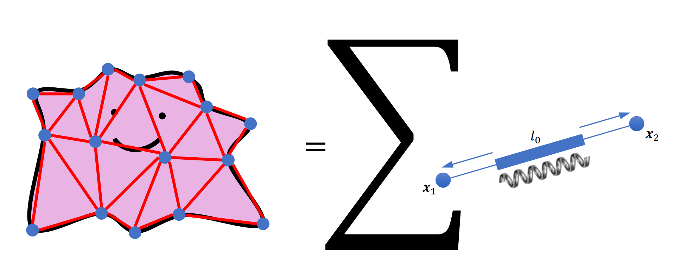
</div>

网格可以是二维网格，用于模拟布料、纸张等物体，如下图；也可以是三维体网格，用于模拟体物体 (volume)，如后面段落介绍。

<div  align="center">    
 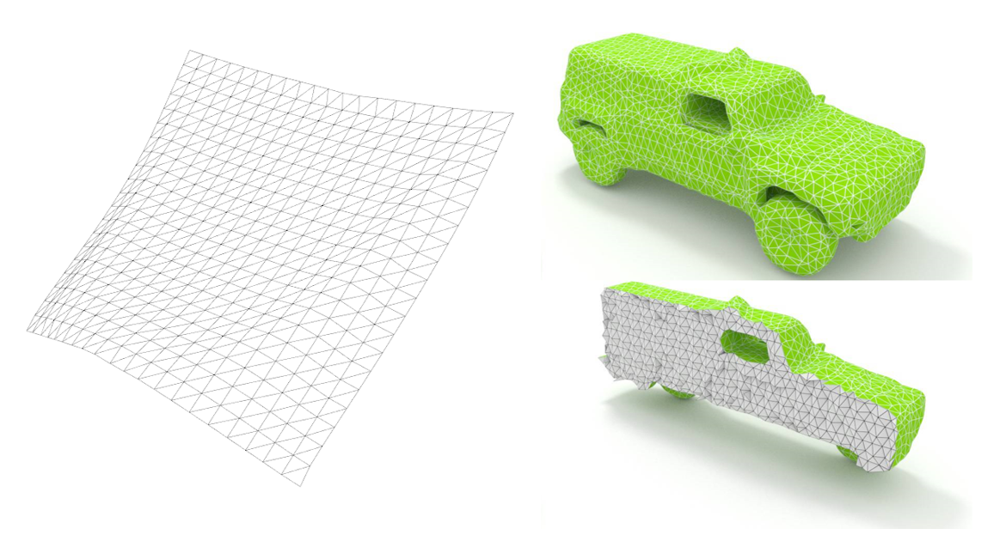
</div>

## 2. 如何运动？

为了让这些离散点动起来，我们需要做时间上的离散:


假设我们有n个顶点，将所有顶点拼成一个矩阵 $\mathbf{x} \in \mathbb{R}^{3n\times 1}$，

为了让物体运动起来，一种思路是我们可以让每个顶点有一个运动的速度。如果使用半隐式时间积分：

$$
\mathbf{x}^{n+1} = \mathbf{x}^{n} + h \mathbf{v}^{n+1} \tag{1}
$$

那么速度 $\mathbf{v}^{n+1} \in \mathbf{R}^{3n\times 1}$ 要怎么确定呢? 根据牛顿第二定律，我们有：

$$
\mathbf{v}^{n+1} =\mathbf{v}^{n} + h \mathbf{M}^{-1} (\mathbf{f} _ {\text{int}}(\mathbf{x}^n) + \mathbf{f} _ {\text{ext}} )  \tag{2}
$$

其中的 $\mathbf{M} \in \mathbf{R}^{3n \times 3n}$ 为系统的质量矩阵，这里我们将其简单地设置为一个对角矩阵。

> 扩展知识：质量矩阵 $\mathbf{M}$ 实际上描述了一个有限单元的质量与其顶点质量的关系，有两种类别：1. Lump Mass Matrix. 质量全部加到对角项上，也是我们本次作业选择的版本）2. Consistant Mass Matrix. 包含非对角项，是通过型函数(Shape Function)推导出来的。具体可以阅读[Consistent vs Lumped Mass](https://www.strand7.com/strand7r3help/Content/Topics/Elements/ElementsMassMatrix.htm). 

根据能量观点，记 $E$ 为系统的弹性能，那么弹性力 $\mathbf{f}_{\text{int}}$ ：

$$
\mathbf{f}_{\text{int}} = -\nabla E
$$

如果有能量梯度的表达式，我们就能求出弹性力，再加上重力等外力得到顶点受到的合力（这里我们没有考虑PPT中的阻尼力，而是在速度上乘以一个阻尼系数来实现阻尼，会在下面介绍），就可以根据公式(1)(2)让物体运动了！

## 3. 能量是多少？

首先我们定义一根弹簧 $i$ 的能量为：

$$
E_i = \frac{k}{2} (\|\mathbf{x} _ {i1} - \mathbf{x}_{i2}\| - L)^2 
$$

我们记录 $\mathbf{x}_{i} := \mathbf{x} _ {i1} - \mathbf{x} _ {i2}$
那么总体的能量为：

$$
E = \sum_{i} E_i = \sum_{i} \frac{k}{2} \left(\|\mathbf{x}_{i}\| - L\right)^2
$$

可以求出其梯度为：

$$
\nabla E = \sum_i k (\|\mathbf{x}_i\| - L)\frac{\mathbf{x}_i}{\|\mathbf{x}_i\|} \tag{3}
$$

只要在`MassSpring.cpp`（(在文件夹[`Framework3D\source\nodes\nodes\geometry\mass_spring\`](../../../Framework3D/source/nodes/nodes/geometry/mass_spring/)中)的 `computeGrad` 函数中填上这一部分梯度的计算:


```C++
Eigen::MatrixXd MassSpring::computeGrad(double stiffness)
{
    Eigen::MatrixXd g = Eigen::MatrixXd::Zero(X.rows(), X.cols());
    for(const auto& e: E)
    {
        // --------------------------------------------------
        // HW_TODO: Implement the gradient computation
        
        // --------------------------------------------------
    }
    return g; 
}
```
和`step`函数中半隐式时间积分的公式:

```C++
else if(time_integrator == SEMI_IMPLICIT_EULER)
{
    // Semi-implicit Euler
    Eigen::MatrixXd acceleration = -computeGrad(stiffness); 
    acceleration.rowwise() += acceleration_ext.transpose(); 

    // HW_TODO: Implement semi-implicit Euler time integration
    // vel += ... 
    // X += ...
}
```

最后可以为速度乘上阻尼系数 `vel *= damping` 来模拟阻尼。这样就可以完成作业的第一部分了。

这里我们需要固定一些点（狄利克雷边界条件）。在MassSpring这个类中我们提供了`dirichlet_bc_mask`这个bool数组来表示一个顶点是否固定，如在初始化的时候：
```C++
dirichlet_bc_mask.resize(X.rows(), false);
unsigned n_fix = sqrt(X.rows()); // number of fixed vertices, here we assume this is a square cloth 

// Fix two vertices 
dirichlet_bc_mask[0] = true;
dirichlet_bc_mask[n_fix - 1] = true;
```
然后，直接将这些固定点的外力和速度设置为0就可以。

如果正确实现了上面的步骤，并且将1. 劲度系数`stiffness`、2.时间步长`h`、3. 阻尼系数`damping`设置为一个合理的值后（需要手动调观察效果, 如尝试`stiffness` = 5000, `h` = 0.001, `damping`=0.995），在`grid20x20`的mesh上可以得到类似下图的结果：

<div  align="center">    
 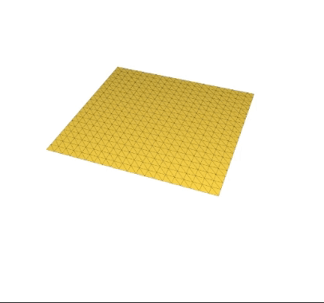
</div>

我们鼓励大家先在小mesh上（如`grid1x1`与`grid2x2`）进行实验，遇到错误的结果可以直接打印出所需要查看的变量或使用断点调试，在程序运行无误后再使用更大的mesh（`grid10x10`与`grid20x20`,甚至自行构建更大规模的mesh）进行实验。

你也可以尝试固定不同的点，并比较不同的劲度系数、时间步长、damping对结果的影响，不同规模的mesh也需要设置不同的仿真参数，**鼓励在报告中包含不同仿真参数的结果比较相关内容**。

所需要连接的节点图如下（建议在检查完`read usd`节点正确读取mesh后，再连接到MassSpring节点，否则会报错），需要把`time integrator type`设为1 ，本次节点系统提供了时间轴功能，可以拖动。之前已经计算的部分会被缓存下来，回看的时候不会重新计算。如果需要reset，将时间拖动为0即可。按空格可以自动播放。

<div  align="center">    
 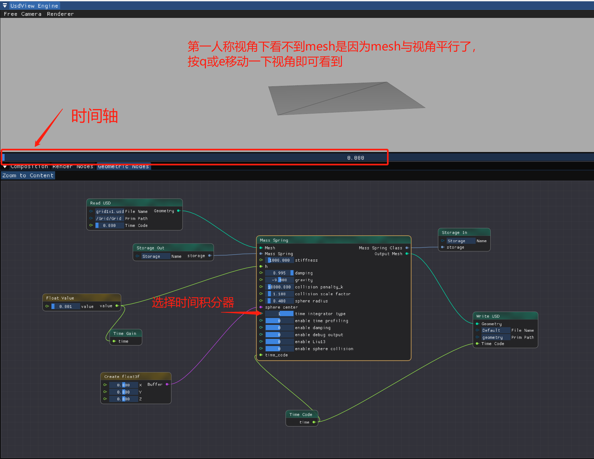
</div>


> 本次作业为了几何表示的方便，我们没有使用交叉型的网格表示弹簧质点系统（如下所示），只使用了三角网格。交叉型网格能够考虑更多布料在弯曲时的约束，如果你有兴趣，也可以在程序中加入这些额外的边连接，并比较它和三角网格的仿真效果的区别。
> <div  align="center">    
> 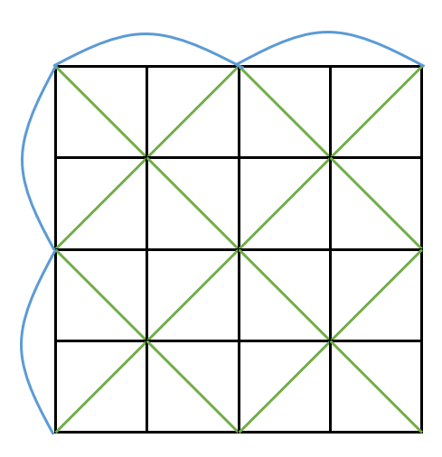
> </div>
> 
>


## 4. 艺术就是......爆炸！ 
但当我们实现了上面的半隐式时间积分后，会发现在时间步调大时，发生爆炸, 如下所示。


<div  align="center">    
 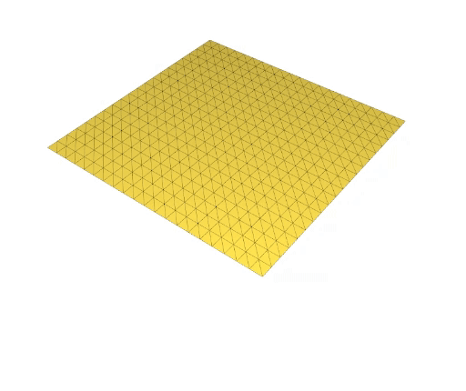
</div>

恭喜你，你创造出了一个艺术作品......但是为了完成本次作业，你需要继续实现一个更加稳定的时间积分方法。

<div  align="center">    
 
</div>

> 爆炸的原因与不同时间积分方法的稳定性有关系。
> 如果想了解从几何的角度去解释显式欧拉积分、半隐式欧拉积分（又名辛欧拉积分，与辛几何有关系）与隐式欧拉积分的稳定性，请阅读[Discrete Geometric Mechanics for Variational Time Integrators](http://www.geometry.caltech.edu/pubs/SD06.pdf)
> 

接下来我们需要实现隐式欧拉积分：

$$
\begin{align}
\mathbf{x}^{n+1} &= \mathbf{x}^{n} + h \mathbf{v}^{n+1} \\
\mathbf{v}^{n+1} &=\mathbf{v}^{n} + h \mathbf{M}^{-1} (\mathbf{f} _ {\text{int}}(\mathbf{x}^{n+1}) + \mathbf{f}_{\text{ext}} ) 
\end{align} \tag{3}
$$

但是发现这个问题需要变成一个关于 $\mathbf{x}^{n+1}$ 的方程。

我们下面介绍一种常用的思路来求解。

整理一下：

$$
\mathbf{x}^{n+1} = \mathbf{x}^{n} + h \mathbf{v}^{n} + h^2 \mathbf{M}^{-1} (-\nabla E(\mathbf{x^{n+1}}) + \mathbf{f}_{\text{ext}} ) \tag{4}
$$

我们定义 $\mathbf{y} := \mathbf{x}^n + h \mathbf{v}^n + h^2 \mathbf{M}^{-1} \mathbf{f}_{\text{ext}}$

可以把上面的公式(4)转变为：

$$
\frac{1}{h^2} \mathbf{M} (\mathbf{x}^{n+1} - \mathbf{y}) + \nabla E(\mathbf{x}^{n+1}) = \mathbf{0}
$$

这个公式可以视为一个优化问题的一阶最优条件（KKT），
那么其实是在优化这个问题（记 $\mathbf{x} = \mathbf{x}^{n+1} \in \mathbf{R}^{3n \times 1}$ ）：

$$
\min_{\mathbf{x}} \quad g(\mathbf{x}) = \frac{1}{2 h^2}(\mathbf{x} - \mathbf{y})^\top   \mathbf{M} (\mathbf{x} - \mathbf{y}) + E(\mathbf{x}) \tag{5}
$$

这回到了大家（可能）学过的最优化领域。

> 在图形学中, $g$ 的一个名字是increment potential. $\frac{1}{h^2} \mathbf{M}(\mathbf{x} - \mathbf{y}) + \nabla E(\mathbf{x})$ 被称为惯性项(inertia term)，$E(\mathbf{x})$ 被称为弹性项(Elasticity). 

能量 $g$ 的导数为：

$$
\nabla g(\mathbf{x}) = \frac{1}{h^2} \mathbf{M}(\mathbf{x} - \mathbf{y}) + \nabla E(\mathbf{x})
$$


为了求解优化问题，我们可以使用梯度下降，但是其收敛速度比较慢（线性收敛速度）。在图形学中，更加常用的做法是使用牛顿法：

$$
 \mathbf{x}^{n+1} = \mathbf{x}^n - \mathbf{H}^{-1} \nabla \mathbf{g} 
$$

那么需要求能量 $g$ 的Hessian矩阵 $\mathbf{H} = \nabla^2 g$。

首先我们来看一根弹簧能量的Hessian：

$$
\begin{align}
\mathbf{H}_i &= \nabla^2 E_i  \\
&=k \frac{\mathbf{x}_i {\mathbf{x}_i}^\top}{\|\mathbf{x}_i\|^2}+k\left(1-\frac{L}{\|\mathbf{x}_i\|}\right)\left(\mathbf{I}-\frac{\mathbf{x}_i \mathbf{x}_i^{\mathrm{T}}}{\|\mathbf{x}_i\|^2}\right) \\
\end{align}
$$

那么总体的Hessian $\mathbf{H} \in \mathbf{R}^{3n\times 3n}$ 为单根弹簧Hessian $\mathbf{H} \in \mathbf{R}^{3 \times 3}$ 按照顶点索引组装起来：

<div  align="center">    
 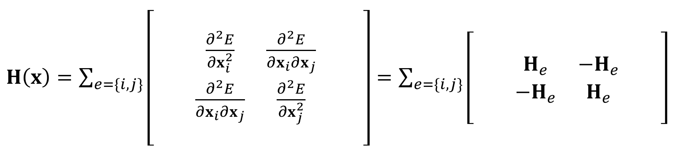
</div>


最后我们写出 $g$ 的Hessian：

$$
\nabla^2 g = \frac{1}{h^2} \mathbf{M} + \mathbf{H}
$$

那么现在我们就可以使用牛顿法优化：

$$
\mathbf{x}^{n+1} = \mathbf{x}^n - \mathbf{H}^{-1} \nabla g (\mathbf{x}^n)
$$

> 这里其实还涉及到一个Line Search的部分，一般基于线搜索方法优化问题的流程：1. 先确定搜索方向 $\mathbf{p}$（我们这里 $\mathbf{p} = \mathbf{H}^{-1}\mathbf{\nabla g}$ ），2. 然后确定要前进的步长 $\alpha$（该步骤称为Line Search），3. 最后更新 $\mathbf{x}^{n+1} = \mathbf{x}^n - \alpha \mathbf{p}$  。
>由于牛顿法的推荐步长是1，这里我们就不额外进行Line Search

$\mathbf{H}$ 是一个稀疏矩阵（只有相邻的顶点才会在矩阵中有对应的非零元素），我们使用`Eigen::SparseMatrix`来存储。

那么需要在本次作业中实现以下`MassSpring.cpp`部分的代码:

```C++
Eigen::SparseMatrix<double> MassSpring::computeHessianSparse(double stiffness)
{
    unsigned n_vertices = X.rows();
    Eigen::SparseMatrix<double> H(n_vertices * 3, n_vertices * 3); 

    unsigned i = 0; 
    auto k = stiffness; 
    const auto I = Eigen::MatrixXd::Identity(3, 3); 
    for(const auto& e: E)
    {
        // --------------------------------------------------
        // HW_TODO: Implement the sparse version Hessian computation
      
        // --------------------------------------------------
    }
    H.makeCompressed(); 

    return H;
}
```
然后实现`step`函数中隐式时间积分部分的代码，并且，我们提供了`flatten`与`unflatten`函数将 $\mathbf{R}^{n \times 3}$ 与 $\mathbf{R}^{3n}$ 的向量进行互相转换: 

```C++
    if(time_integrator == IMPLICIT_EULER)
    {
        // Implicit Euler
        auto H_elastic = computeHessianSparse(stiffness); // size = [nx3, nx3]
        // HW_TODO: check SPD

        // Compute Y

        // Compute grad_g 

        // Compute delta_X using a Eigen linear solver (You can use `flatten` and `unflatten` function to transfer between different shapes)

        // Finally, update X and vel
        Eigen::MatrixXd delta_X_flatten = solver.solve(grad_E_flatten);
        ...
        // Other necessary code
        
    }
```

> Hessian的正定性问题：牛顿法并不是无条件收敛，也就是牛顿法给出的下降方向不一定能够使得能量真的下降！即不满足 $(\mathbf{H}^{-1}\nabla g)^{\top} \nabla g > 0$ . 只有Hessian正定的时候才能保证收敛。
> 
> 你可以首先不管这个问题，看看仿真结果如何。如果出现问题，为了让Hessian正定，你可以尝试：
> 1. **在 $L_i > \|\mathbf{x}_i \|$ 时**，令第$i$根弹簧 $\mathbf{H}_i$ 近似为 $\mathbf{H}_i \approx k \frac{\mathbf{x}_i {\mathbf{x}_i}^\top}{\|\mathbf{x}_i\|^2}$ . 
> 2. 为Hessian对角线加上 $\epsilon \mathbf{I}$， $\epsilon$ 为可调参数，来让Hessian最小的特征值大于0. 
> 3. 对Hessian做SVD分解，然后精确地获取其最小特征值，令其大于0，再重新用SVD得到新的Hessian（速度预期会很慢）
> 

慢着，如果要在这个求解过程中固定点，怎么办？如果仍然是解完之后将固定点的位置简单地设置回去，就会出现下面边界区域被过度拉长的情况：

<div  align="center">    
 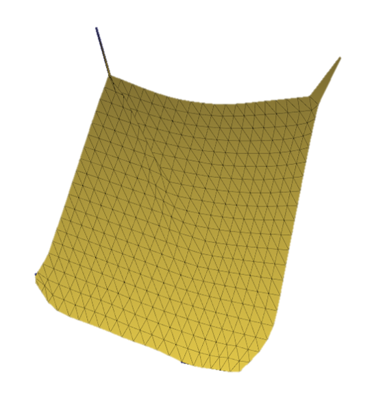
</div>


问题根源还是要在求解的时候考虑硬约束。

$$
\min_{\mathbf{x}} \quad g(\mathbf{x}) = \frac{1}{2 h^2}(\mathbf{x} - \mathbf{y})^\top   \mathbf{M} (\mathbf{x} - \mathbf{y}) + E(\mathbf{x}) \\
s.t. \quad c(\mathbf{x}) = \mathbf{S}\mathbf{x} = \mathbf{0}
$$

广义来说其实是一个带约束优化问题。那么我们需要使用引入拉格朗日乘子法来求解吗？

其实不用。可以通过作业3泊松融合里面对边界条件一样的处理：在求解方程的时候修改Hessian矩阵，让固定点对应的系数为1就行。或者 $\mathbf{H}^{\text{new}} = S^T\mathbf{H}S$ 来获得一个更小的矩阵，其中 $S$ 为选择矩阵。

如果实现正确，将1. 劲度系数`stiffness`和2.时间步长`h`设置为合理的值（隐式时间积分不需要调阻尼系数），并考虑了Hessian的正定性：就可以看到下面的仿真结果（gif经过加速），可以实现比半隐式时间积分大20倍甚至更多的时间步长（但由于需要组装Hessian并求解线性方程组，隐式时间积分每一步的时间会比半隐式时间积分长）：

<div  align="center">    
 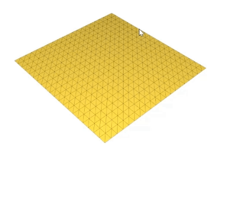
</div>

如果你需要测量性能，我们在程序中提供了`TIC`和`TOC`宏来打印程序运行时间，使用方式如下（在`enable_time_profiling = true`的时候会print出结果）
```C++
TIC(function to profile)
your_function(); 
TOC(function to profile)
```


那么实现到这里，恭喜你，你已经完成了本次作业的必做部分！

你可以在我们的节点系统框架中使用`Mesh add texture`节点，为布料加上纹理，例如结果（可以使用路径追踪渲染器渲染）：

<div  align="center">    
 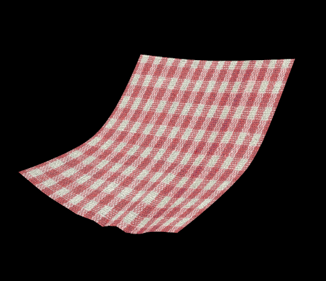
</div>

附上本次作业需要的节点图（可以直接按照下图连接，不用对节点部分做太多修改）：

<div  align="center">    
 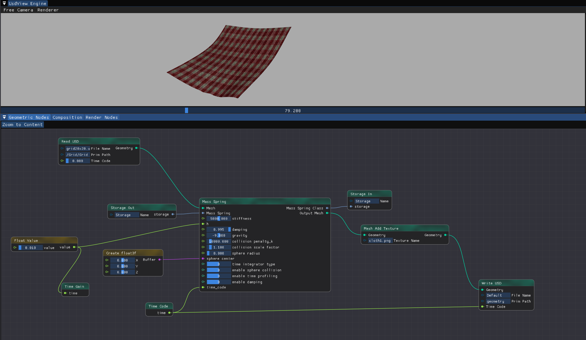
</div>


下面的内容和 Part2 是Bonus内容，供有时间和有兴趣的同学选择性阅读。

## 5. (Optional) 考虑与其他物体的交互

> “没有碰撞的仿真是没有灵魂的！” 
>     ——Prof. 蒋陈凡夫@UCLA

模拟碰撞与摩擦也是图形学中一个重要的课题，处理得不好就会出现游戏中常见的“穿模”问题。
本次作业，我们还可以考虑弹簧质点系统与一个球的碰撞。甚至可以让这个球运动起来。

我们可以使用一个如下图所示的简单的基于惩罚的接触力：

<div  align="center">    
 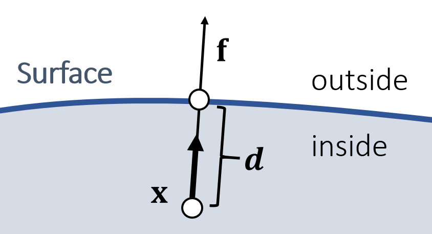
</div>

$$
\mathbf{f} = k^{\text{penalty}} \max(s  r- \|\mathbf{x}-\mathbf{c}\|, 0)\frac{(\mathbf{x} - \mathbf{c})}{\|\mathbf{x} -\mathbf{c} \|}
$$

其中 $\mathbf{c}$ 为球心， $r$    为球半径， $s$   为半径的一个放大系数（如让 $s$ =1.1），用于在实际未发生接触时就产生接触力以减少视觉上的穿透（程序中为`collsiion_scale_factor`）, $k^{\text{penalty}}$ 为可调参数。


需要在`MassSpring`的`getSphereCollisionForce`函数中实现下面的部分：

```C++
// ----------------------------------------------------------------------------------
// Bonus part
Eigen::MatrixXd MassSpring::getSphereCollisionForce(Eigen::Vector3d center, double radius)
{
    Eigen::MatrixXd force = Eigen::MatrixXd::Zero(X.rows(), X.cols());
    for(int i = 0; i < X.rows(); i++)
    {
        // HW_Optional_TODO: implement penalty-based collision force 
     
    }
    return force;
}
// ----------------------------------------------------------------------------------
```

如果实现正确并调整了合适的参数（如果发生爆炸，记得检查Hessian正定性并做相应的处理），可以看到下面的结果：


<div  align="center">    
 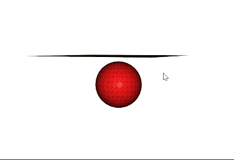
</div>


至此，你已经实现了一个基础的带与球碰撞的弹簧指导仿真系统。但是基于惩罚力的方式无法保证不穿透，需要手动调惩罚力的因子。

所需要连接的节点图：

<div  align="center">    
 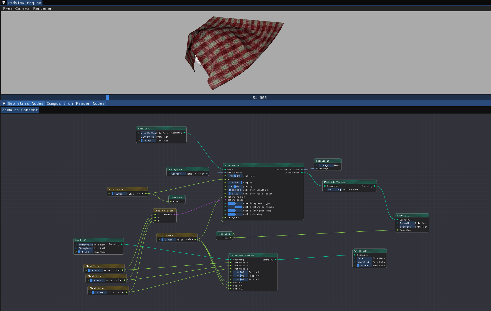
</div>


> 拓展思考：
> 1. 从能量的观点去解决碰撞？-> 如何建模关于物体间距离的能量？能否把球与布料之间的碰撞写成类似弹簧质点能量的形式？
> 
> 2. 如果要保证严格不穿透，如何做？（提示：可以将发生“碰撞后不穿透”建模为约束，回到求解带约束优化问题的思路。求解带约束优化问题的常用方法有：序列二次规划（SQP）、增广拉格朗日乘子法、内点法等）

## 未完待续：Part2. 弹簧质点系统的加速方法！

在实践中，我们发现牛顿法求解弹簧质点仿真还是有点慢。（我们提供了`TIC`和`TOC`宏来打印程序运行时间）

如何加速？我们将在Part2进行介绍，这也是本次作业的选做内容。

## 参考资料
1. GAMES 103 Lecture 2 & 5 
2. [布料系统原理浅析和在Unity手游中的应用](https://blog.uwa4d.com/archives/2008.html#:~:text=%E8%80%8C%E7%8E%B0%E4%BB%A3%E6%B8%B8%E6%88%8F%E5%BC%95%E6%93%8E%E4%B8%AD%E5%AE%9E%E7%8E%B0%E5%92%8C%E9%9B%86%E6%88%90%E7%9A%84%E6%A8%A1%E5%9E%8B%E9%80%9A%E5%B8%B8%E6%98%AF%E5%9F%BA%E4%BA%8E%E7%89%A9%E7%90%86%E6%96%B9%E6%B3%95%E7%9A%84%E8%B4%A8%E7%82%B9%2D%E5%BC%B9%E7%B0%A7%E6%A8%A1%E5%9E%8B%EF%BC%88Mass%2DSpring%20Model%EF%BC%89)


