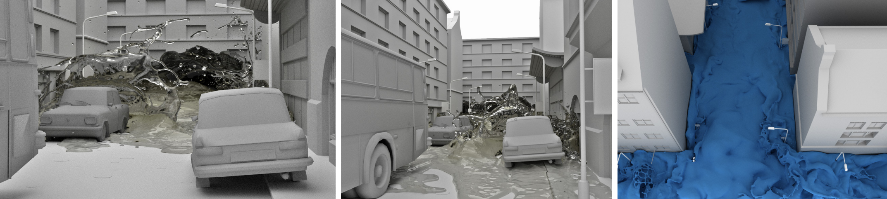
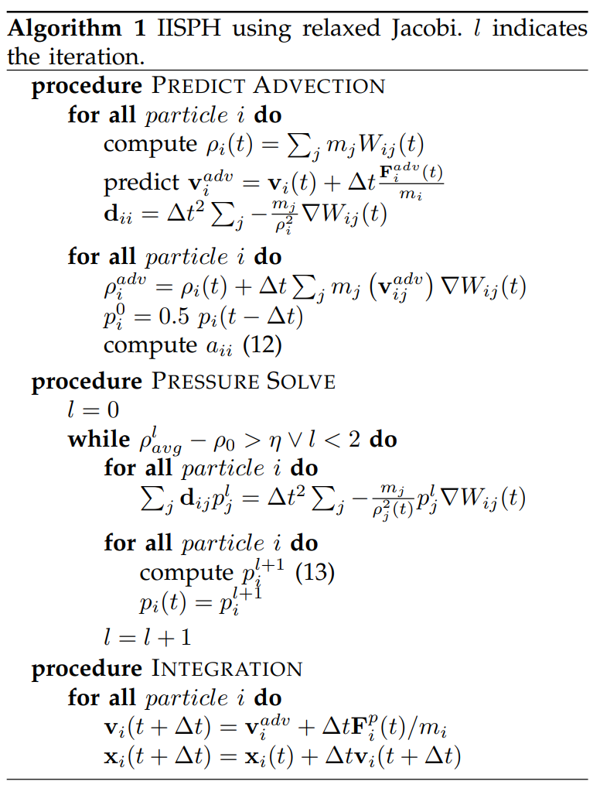

# SPH流体仿真简明教程Part2 之 IISPH

在Part1中，我们介绍了WCSPH这种弱可压缩的流体仿真方法，本章我们将介绍能够更好地求解不可压缩性约束从而提高仿真稳定性的IISPH方法。

原论文链接：[2013_TVCG_IISPH](https://cg.informatik.uni-freiburg.de/publications/2013_TVCG_IISPH.pdf)

<div  align="center">    
 
</div>

## 1. Pressure Poisson Equation (PPE) 

根据流体仿真的一般流程，

在没有压力时，流体粒子的速度为

$$
\mathbf{v}^* = \mathbf{v}(t) + \Delta t \mathbf{a}^{\text{non-pressure}}(t)
$$

如果没有任何压力，那么流体粒子的密度为

$$
\rho^* = \rho(t) - \Delta t \rho(t) \nabla \cdot \mathbf{v}^*
$$

这个时候流体是很可能不满足不可压缩性的。此时流体的密度误差为 $\rho_0 - \rho^*$ ，

由于从优化的角度上，压力其实可以看做对流体违反不可压缩性约束而带来的惩罚力：

我们希望施加压力后，带来的流体粒子的速度改变量为：（注意这个时候分母用的还是 $\rho(t)$ ,而不是 $\rho^*$ ）

$$ 
\Delta  \mathbf{v} = -\Delta t \frac{1}{\rho(t)} \nabla p \tag{1}
$$ 


由于 $\frac{D \rho}{D t} = -\rho(t) \nabla \cdot \mathbf{v}$ ,

那么由压力带来的速度改变量对于密度的贡献为（先把导数变为差分，然后把公式(1)代入上式）：

$$
\begin{aligned}
\Delta \rho &= -\Delta t\rho(t) \nabla \cdot (\Delta \mathbf{v}) \\ 
&= \Delta t \rho(t) \nabla \cdot (\Delta t \frac{1}{\rho(t)}\nabla p) \\ 
&= (\Delta t)^2 \nabla^2 p
\end{aligned}
$$

为了消除密度误差，那么应该有： $\rho^* + \Delta \rho = \rho_0$, 即  $\Delta \rho = \rho_0 - \rho^*$ :

写到一起并整理，得：

$$
\nabla^2 p =  \frac{\rho_0 - \rho^*}{(\Delta t)^2} \tag{2}
$$

因此可以构建出一个关于 $p$ 的泊松方程。

## 2. 构建显式矩阵的困难

但是求解的时候，我们发现一个巨大问题： $\nabla^2 p$ 是怎么构建的呢？在之前有固定拓扑的情况下， $\nabla^2$ 算子可以比较容易地写出。

首先我们回顾一下 $\nabla p$ :

$$
 \nabla p_i = \rho_i \sum_j m_j \left(\frac{p_i}{\rho_i^2} + \frac{p_j}{\rho_j^2} \right) \nabla W_{ij} \tag{3}
$$

我们记压力带来的加速度为 $\mathbf{a}^p_i = -\frac{1}{\rho_i} \nabla p_i$ 

那么 $\nabla^2 p = \nabla \cdot \nabla p$ （Laplacian = 梯度的散度），推导如下：

$$
\begin{aligned}
\nabla^2 p_i &= \nabla \cdot (-\rho_i \mathbf{a}^p_i) \\
&= -\rho_i \sum_j \frac{m_j}{\rho_j} (\mathbf{a}^p_j - \mathbf{a}^p_i) \cdot \nabla W_{ij} \\ 
&= \rho_i \sum_j \frac{m_j}{\rho_j} (\mathbf{a}^p_i - \mathbf{a}^p_j) \cdot \nabla W_{ij} \\ 
\end{aligned} 
$$

让 $\rho_i \approx \rho_j$ ，那么：

$$
\nabla^2 p_i \approx \sum_j m_j (\mathbf{a}^p_i - \mathbf{a}^p_j) \cdot \nabla W_{ij} \tag{4}
$$

> 这里的 $\mathbf{a}^p_i$ 就是原论文中的 $\frac{F^p_i(t)}{m_i}$ ， 对应原论文公式(5)

如果再把 $\mathbf{a}^p$ 进行展开，我们可以看到，这个Laplacian的表达式会变得极其复杂，让我们显式构建矩阵 $\mathbf{A}$ 以求解关于所有粒子的压强拼成的向量 $\mathbf{p}$ 的方程组 $\mathbf{A p = b}$ 非常困难！

不过，换一个思路，我们真的需要显式构建矩阵 $\mathbf{A}$ 吗？

## 3. 无需显式构建矩阵的迭代法

我们知道，求解一个线性方程组我们可以使用迭代法（和前几次作业的区别与联系？），如共轭梯度法，Jacobi迭代法等。

下面，我们介绍一下松弛Jacobi迭代的做法。

为了求解 $\mathbf{Ax = b}$ ，Jacobi迭代的做法是将 $\mathbf{A}$ 拆分为 对角线元素、上下三角组成的三个矩阵 $D, L, U$ ：

$$
x^{(k+1)} = D^{-1} (\mathbf{b} - (L+U) x^{(k)})
$$

写成每个元素的形式:

$$
\mathbf{x} _ i^{(k+1)}=\frac{1}{a_{i i}}\left(b_i-\sum_{j \neq i} a_{i j} \mathbf{x}_j^{(k)}\right), \quad i=1,2, \ldots, n \tag{5}
$$

为了提高收敛效率，可以使用松弛Jacobi迭代：

$$
\begin{aligned}
\mathbf{x}^{(k+1)} &= \omega D^{-1} (\mathbf{b} - (L+U) \mathbf{x}^{(k)}) + (1 - \omega) \mathbf{x}^{(k)}  \\
&=  \omega D^{-1} \mathbf{b} + (I - \omega D^{-1} \mathbf{A}) \mathbf{x}^{(k)} \\
&= \mathbf{x}^{(k)} + \omega D^{-1}(\mathbf{b} - \mathbf{A} \mathbf{x}^{(k)})
\end{aligned}
$$

其中 $\omega$ 为松弛因子。

写成每个元素的形式：

$$
\begin{aligned}
\mathbf{x}_ i^{(k+1)} &=\mathbf{x} _ i^{(k)} + \frac{\omega}{a _ {i i}}\left(b_i- \sum_{j} a_{i j} \mathbf{x}_ j^{(k)}\right), \\ 
&= \mathbf{x}_ i^{(k)} + \frac{\omega}{a_{i i}}\left(b_i- (\mathbf{A}\mathbf{x}^{(k)})_i \right),
\quad i=1,2, \ldots, n
\end{aligned} \tag{6}
$$

其中  $(\mathbf{A}\mathbf{x}^{(k)})_i$  表示  $(\mathbf{A}\mathbf{x}^{(k)})$ 这个向量的第 $i$ 个元素。

发现了吗？现在我们只需要知道  $\mathbf{Ax}$  这个向量即可！

那么，放在IISPH方法中，上面松弛Jacobi的思想是怎么实现的呢？

我们很快会发现， $\nabla^2 p_i = \mathbf{Ap} _ i$  其实直接就是计算(4)式！而  $\mathbf{b}_i = \frac{\rho^* - \rho_0}{(\Delta t)^2}$ . 


不过，唯一麻烦的是，我们还是需要 $a_{ii}$ 的表达式，这里直接给出：

$$
a_{i i}=- \sum_j m_j\left(\mathbf{d}_ {i i}-\mathbf{d} _ {j i}\right) \nabla W_{ij}
$$

其中，

$$
\mathbf{d}_ {i i} = \sum _ j \frac{m_ j}{\rho_i^2} \nabla W_{i j} \\
\mathbf{d}_ {ji} = \frac{m_i}{\rho_i^2} \nabla W_{ji} \\
$$

> 我们这里的 $a_{ii}, \mathbf{d}_ {ii}, \mathbf{d}_ {ji}$ 和原论文中的定义相差 $(\Delta t)^2$， 注意甄别。

> $a_{ii}$ 推导如下，感兴趣的同学可以自己推导一遍：
>
> 因为:
> 
> $$
\begin{aligned}
& \mathbf{a}^p_i = -\frac{1}{\rho_i} \nabla p \\
 &= - \sum_j m_j\left(\frac{p_i}{\rho_i^2}+\frac{p_j}{\rho_j^2}\right) \nabla W_{i j} \\
& = - \left( \underbrace{\left( \sum_j \frac{m_j}{\rho_i^2} \nabla W_{i j}\right)}_ {\text{记为} \mathbf{d} _ {i i}} p_i+\sum_j \underbrace{ \frac{m_j}{\rho_j^2} \nabla W_{i j}}_ {\text{记为} \mathbf{d} _ {i j}} p_j \right),
\end{aligned}
$$
> 
> 那么，如果用下标 $k$ 来表示粒子 $j$ 的邻居们，
> 
> $$
\begin{aligned}
\nabla^2 p 
&= \sum_j m_j (\mathbf{a}^p_i - \mathbf{a}^p_j) \cdot \nabla W_{ij} \\
& = - \sum_j m_j \left((\mathbf{d} _ {ii} p_i + \mathbf{d} _ {ij} p_j) - (\mathbf{d}_ {jj} p_j + \mathbf{d} _ {jk} p_k )\right) \cdot \nabla W_{ij}
\end{aligned} \tag{4}
> $$
> 
> 为了求 $a_{ii}$，只需要关注 $k = i$ 的时候，然后挑出这些系数：
> 
> $$
\begin{aligned}
a_{i i} &= -\sum_j m_j\left(\mathbf{d} _ {i i}-\mathbf{d} _ {j i}\right) \nabla W_{ij} 
\end{aligned}
$$
> 
> 其中 $\mathbf{d} _ {j i} =  \frac{m_i}{\rho_i^2} \nabla W_{ji}$ .


那么，最后使用松弛Jacobi迭代来求解关于压强的泊松方程（公式(2)）的算法如下（图片来自原论文）：

<div  align="center">    
 
</div>

建议大家在看完文档后有了基础认识后，进一步阅读原论文中提到的实现细节(提醒：本算法公式下标比较繁杂，需要小心谨慎), 然后所需要写的代码为[`IISPH.cpp`](../../../Framework3D/source/nodes/nodes/geometry/sph_fluid/iisph.cpp)的以下部分：


```C++
void IISPH::step()
{
    // (HW Optional)
}

void IISPH::compute_pressure()
{
    // (HW Optional) solve pressure using relaxed Jacobi iteration 
    // Something like this: 

    //double threshold = 0.001;
    //for (unsigned iter = 0; iter < max_iter_; iter++) {
    //    double avg_density_error = pressure_solve_iteration();
    //    if (avg_density_error < threshold)
    //        break;
    //}
}

void IISPH::predict_advection()
{
    // (HW Optional)
    // predict new density based on non-pressure forces,
    // compute necessary variables for pressure solve, etc. 

    // Note: feel free to remove or add functions based on your need,
    // you can also rename this function. 
}

double IISPH::pressure_solve_iteration()
{
    // (HW Optional)   
    // One step iteration to solve the pressure poisson equation of IISPH

    return 1.0; 
}
```


## 4. 总结与展望
SPH方法还有很多变种，覆盖了流体仿真与流固耦合甚至弹性体仿真的很多领域。如果想进一步学习SPH方法在图形学中的应用，欢迎访问 [SPH Tutorial](https://sph-tutorial.physics-simulation.org/). 

## 参考资料
1. [paper "Implicit Incompressible SPH"](https://cg.informatik.uni-freiburg.de/publications/2013_TVCG_IISPH.pdf)
2. [SPH Tutorial](https://sph-tutorial.physics-simulation.org/). 


