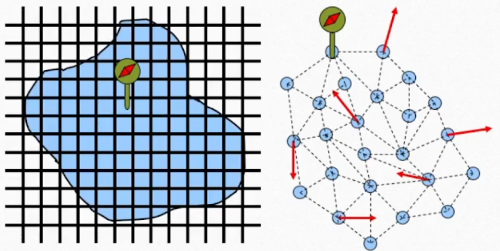
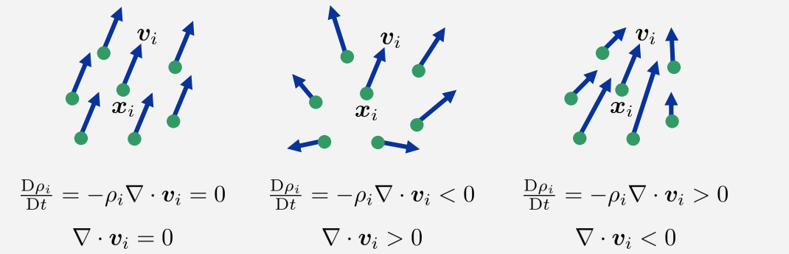
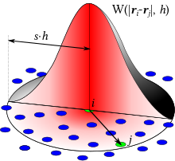
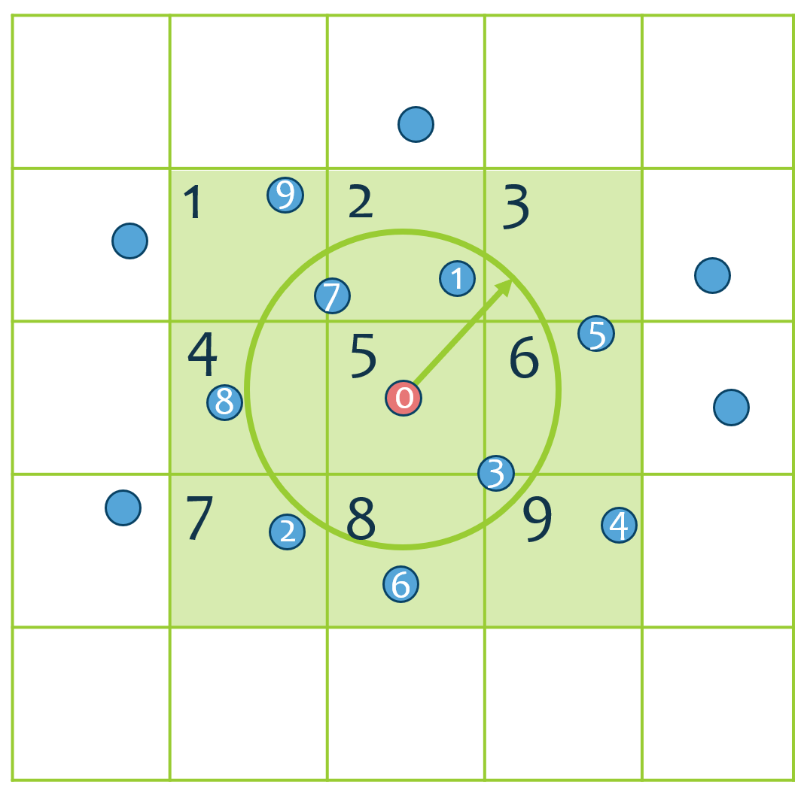
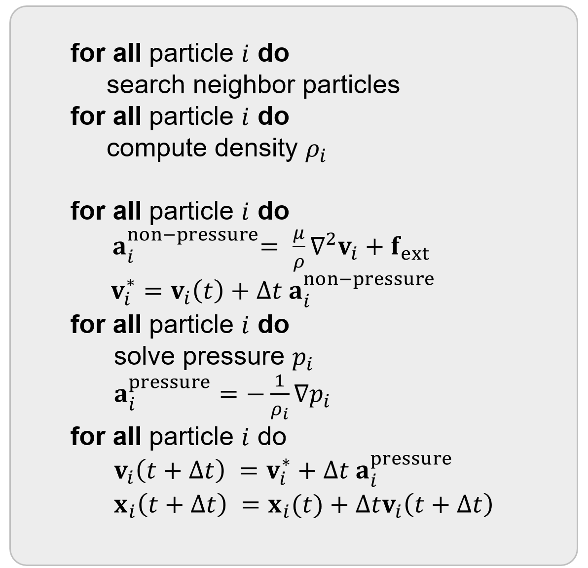
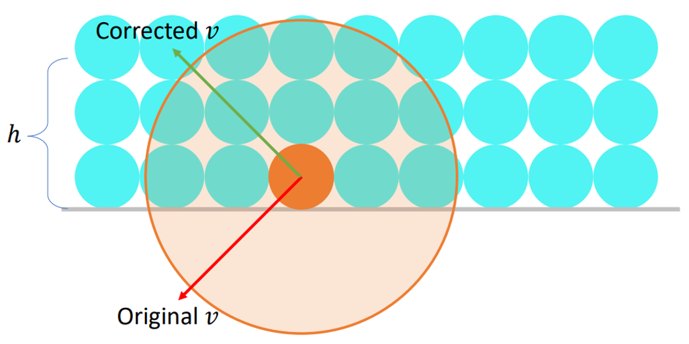
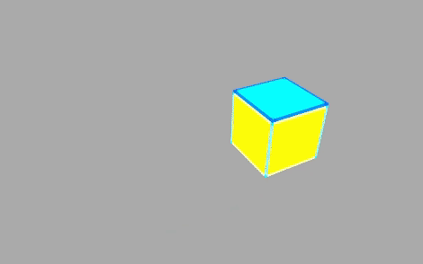
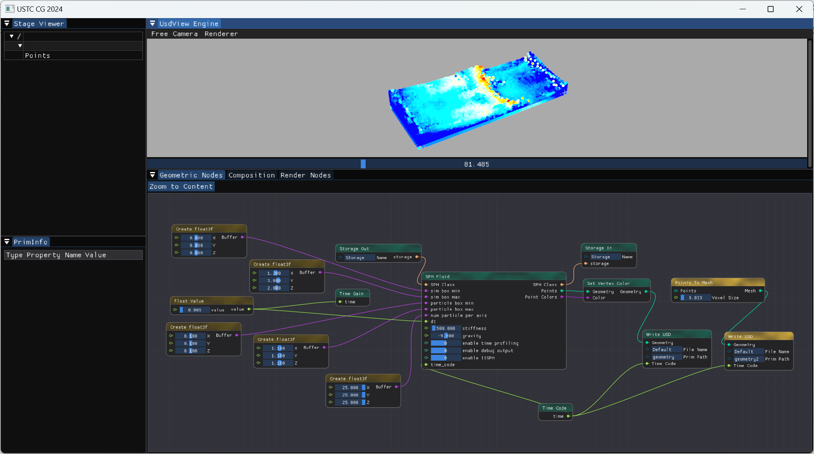
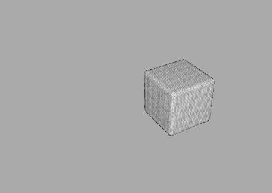
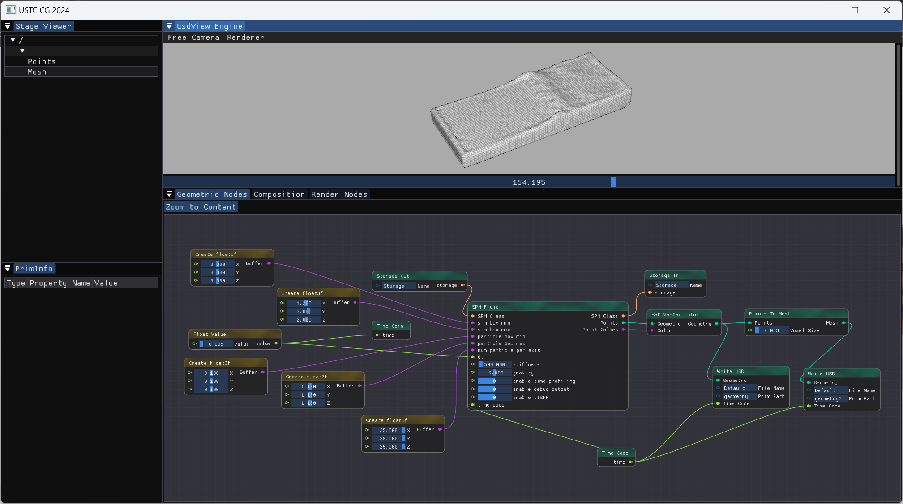

# SPH流体仿真简明教程 Part 1 
本次作业我们将进入流体的世界，你将学习使用光滑粒子流体动力学（SPH: Smoothed Particle Hydrodynamics）这种经典的基于粒子表示的仿真方法计算流体的运动。

> 用>包裹的引用格式呈现的内容为扩展阅读/思考内容，为了实现本次作业可以不看

## 1. 水之道：从Navier-Stokes方程说起 

在游戏与电影中有大量对流体仿真的需求, 下图展示了当前影视界流体仿真的巅峰之作《阿凡达2-水之道》中以假乱真的视觉效果。
为了模拟流体多样的运动及其与固体的交互，我们需要从物理出发，考虑最本质的运动方程。

<div  align="center">    
 
</div>

<div  align="center">    
 
</div>

流体仿真与一般PDE的求解别无二致，都是基于合适的时间离散与空间离散格式，通过数值方法求解描述其运动的PDE。在流体里面，我们求解的是Navier-Stokes方程: 

$$
\begin{aligned}
\rho \frac{D \mathbf{v}}{D t} & =\rho g-\nabla p+\mu \nabla^2 \mathbf{v}  \\
\nabla \cdot \mathbf{v} & =0 
\end{aligned}
$$

其中 $\rho$ 为流体的密度， $\mathbf{v}$ 为速度场， $g$ 是重力加速度，  $p$ 为流体内部压强， $\mu$ 为黏度系数。
第一个方程的右端项分别对应着重力 $\rho g$ 、压力 $-\nabla p$ 、粘性力 $\mu \nabla^2 \mathbf{v}$ 。

> 扩展阅读：我们这里和课上只使用了NS方程的微分形式，但实际上，根据数学建模的不同，NS方程还有其他微分与积分形式。

值得一提的是，(1)式中的 $\frac{D \cdot}{D t}$ 被称为“物质导数 (Material derivative)” 或 “随体导数 (derivative following the motion)”，是全导数在流体力学中的特例：
 
考虑一个跟随流体运动的流体微团，以其为采样点，采样一个空间位置 $\mathbf{x}$ 和时间 $t$ 为自变量的4维物理场 $f = f(\mathbf{x}, t)$（如流体的密度场、压强场、速度场等），流体微团的空间位置 $\mathbf{x} = \mathbf{x}(t)$ 也是时间的函数。那么采样点上的 $f$ 关于 $t$ 的全导数为： $\frac{d f}{d t} = \frac{\partial f}{\partial t} + \frac{\partial f}{\partial x}\frac{\partial x}{\partial t} = \frac{\partial f}{\partial t} + \mathbf{v}\cdot \nabla f$ , 我们将其称为运动的流体微团上物理场 $f$ 的物质导数，记为 $\frac{D f}{Dt}$，它同时考虑了 $f$ 由于时间推移自身的变化和采样点空间运动两个原因带来的变化。

> 举两个例子：
> 
> 1. 测量风速：风速仪固定在气象站上，或风速仪随气象气球而飘动。“前者测量的是风经过固定点的速度，称为空间导数或者欧拉导数。后者测量的是跟随风运动时产生的速度变化，称为物质导数或拉格朗日导数。” ——[来自知乎](
https://www.zhihu.com/question/26992291/answer/1448275421)
> 
> <div  align="center">    
> 
> </div>
> 
> 2. 坐火车早上从广州出发，晚上到北京，温度场  $T$  的变化量不仅与时间 $t$ 有关（早上到晚上），也与火车的位置 $\mathbf{x}(t)$ 有关（广州到北京）。
>
> 关于物质导数更多内容可以看 [南开大学任博老师在21年USTC计算机图形学前沿课程上的视频（5分钟）](https://www.bilibili.com/video/BV1Kf4y157WW?t=664.9&p=8) 。

NS方程的第一行无法独立求解，为了确定压强 $p$ ， 我们需要考虑流体的不可压缩性条件：

$$
\nabla \cdot \mathbf{v} = 0 
$$

结合散度的物理意义（流体的汇聚与发散），我们可以看到不可压缩性其实等价于质量守恒，即空间中任意位置流体的密度的物质导数为0（如果散度不等于0，也就是流体会汇聚到一点 or 从一点流出，那么这一点上流体的质量肯定就会增加 or 减少，不满足质量守恒），如下图所示：

<div  align="center">    
 
</div>

那么有了NS方程，我们就可以考虑如何在计算机中求解了！

## 2. 时空离散，启动！

在时间离散上，流体仿真中常用的是一种称为“算子分裂”（Operator Splitting）的做法，将NS方程拆分为两部分：

1. 不考虑压力，更新 $\mathbf{v}$

$$
\rho \frac{D \mathbf{v}}{D t} =\rho g+\mu \nabla^2 \mathbf{v} 
$$

2. 考虑压强，计算压力，更新 $\mathbf{v}$

$$
\rho \frac{D \mathbf{v}}{D t} = -\nabla p
$$

4. 根据最终的速度，更新粒子位置

在空间离散上，SPH使用粒子去采样物理场，并通过核函数来拟合未采样到的位置的物理量。

<div  align="center">    
 
</div>

SPH中常用的核函数如下（ $d$ 为仿真的维度 ）：

$$
\begin{aligned}
& W(r, h)=\sigma_d \begin{cases}6\left(q^3-q^2\right)+1 & \text { for } 0 \leq q \leq \frac{1}{2} \\
2(1-q)^3 & \text { for } \frac{1}{2} \leq q \leq 1 \\
0 & \text { otherwise }\end{cases} \\
& \text { with } q=\frac{1}{h}\|r\|, \sigma_1=\frac{4}{3 h}, \sigma_2=\frac{40}{7 \pi h^2}, \sigma_3=\frac{8}{\pi h^3}
\end{aligned}
$$

在本次作业框架[`sph_base.cpp`](../../../Framework3D/source/nodes/nodes/geometry/sph_fluid/sph_base.cpp)中，我们提供了核函数的代码。

```C++
// SPH kernel function: h is the support radius, instead of time step size 
static double W(const Eigen::Vector3d& r, double h);
static Eigen::Vector3d grad_W(const Eigen::Vector3d& r, double h);
static double W_zero(double h);
```
在作业框架中，我们使用了`ParticleSystem`这个类去管理粒子系统，每个粒子作为一个类`Particle`携带速度、位置、密度、压强等相关物理量，代码请见[`particle_system.h`](../../../Framework3D/source/nodes/nodes/geometry/sph_fluid/particle_system.h)。

### 2.1  邻居粒子查找

在SPH中，由于不像弹簧质点系统有固定的拓扑，每一个粒子的邻居都在不断地变化。为了查找每个粒子的邻居粒子，如果暴力地遍历所有粒子，计算复杂度为 $O(n^2)$ 。

为了提高查找效率，我们使用了一个空间网格加速结构：首先将粒子根据空间位置分配到相应的立方体网格中（网格边长等于核函数半径），然后只需遍历当前格子的邻居网格中的粒子进行距离判断即可，将复杂度降低到了 $O(n \times k)$ ( $k$ 为每个格子中的平均粒子数 )。

<div  align="center">    
 
</div>

在每一个时间步的开始，我们需要把粒子分配到网格中，然后更新所有粒子的邻居：

```C++
void step()
{
    ps_.assign_particles_to_cells(); 
    ps_.search_neighbors(); 
    // ... other code 
}
```

下面的代码给出了遍历每个粒子`p`的所有邻居，并访问相关物理量的示例：

```C++
for (auto& p : ps_.particles()) {
    auto v_i = p->vel(); 

    // Then traverse all neighbor fluid particles of p
    for (auto& q : p->neighbors()) {
        auto v_j = q->vel(); 
        double w_ij = W(p->x() - q->x(), ps_.h());
        Vector3d grad_W_ij = grad_W(p->x() - q->x(), ps_.h());
        // ... other code 
    }
}
```

为了向大家清楚地展示查找的过程，我们自己编写了邻居粒子查找的代码。如果有兴趣进一步提高程序的性能，你可以尝试使用hw2 image warping中使用过的ANN库。

### 2.2  SPH中的物理量

SPH中密度的计算公式为：

$$
 \rho_i = \sum_{j+i} \left(\frac{m_j}{\rho_j} \right) m_j W(\mathbf{x}_ i - \mathbf{x}_ j, h) =  \sum_{j+i} m_j  W_{ij}
$$

这里我们记 $W_{ij} = W(\mathbf{x}_i, \mathbf{x}_j, h)$， $j$ 表示粒子 $i$ 的所有邻居粒子。 在SPH方法中， $h$ 表示核函数半径，我们用 $\Delta t$ 来表示时间步长。

注意在计算粒子的密度的时候，需要考虑它自身对密度的贡献 $m_i W(0, h)$ （使用 `W_zero` 函数）

程序中，我们让每个流体粒子的质量都相同（等于体积乘以流体静止时的密度，这里静止密度为1000，粒子半径设置为0.025，粒子体积用立方体进行估计，代码请阅读`ParticleSystem`类的实现），可以使用`ps_.mass()` 来访问。

速度散度的计算公式为：

$$
\nabla \cdot \mathbf{v}_ i = \sum_ j \frac{m_j}{\rho_ j} (\mathbf{v}_ j - \mathbf{v}_ i) \cdot \nabla W_{ij}
$$

对于黏性力，我们推荐使用计算公式：

$$
\nabla^2 \mathbf{v}_ i=2(d+2) \sum_j \frac{m_j}{\rho_j} \frac{\mathbf{v}_ {i j} \cdot \mathbf{x}_ {i j}}{\left\|\mathbf{x}_ {i j}\right\|^2+0.01 h^2} \nabla W_{i, j}
$$

其中 $d$ 为仿真的维度，这里为3。我们将黏性系数  $\mu$ 除以粒子密度之后的值 $\nu = \frac{\mu}{\rho}$ （称为动黏性系数 kinematic viscosity）作为可调的仿真参数 `viscosity`。

本次作业中，我们需要计算上面提到的这些物理量，以更新流体粒子在没有压力时的速度（时间离散的第一步）。由于这些代码是所有SPH方法共用的，我们使用了`SPHBase`作为基类，之后的WCSPH与IISPH方法都是作为子类继承自这个基类。你需要填空的代码为[`sph_base.cpp`](../../../Framework3D/source/nodes/nodes/geometry/sph_fluid/sph_base.cpp)中的：

```c++
void SPHBase::compute_density()
{
    // (HW TODO) Traverse all particles to compute each particle's density
    // (Optional) This operation can be done in parallel using OpenMP 
    for (auto& p : ps_.particles()) {
        // ... necessary initialization of particle p's density here  

        // Then traverse all neighbor fluid particles of p
        for (auto& q : p->neighbors()) {

            // ... compute the density contribution from q to p

        }
    }
}

void SPHBase::compute_non_pressure_acceleration()
{
    // (HW TODO) Traverse all particles to compute each particle's non-pressure acceleration 
    for (auto& p : ps_.particles()) {

        // necessary code here to compute particle p's acceleration include gravity and viscosity
        // We do not consider surface tension in this assignment, but you can add it if you like

        //for (auto& q : p->neighbors()) {
        // 
        // Prompt: use the "compute_viscosity_acceleration" function to compute the viscosity acceleration between p and q"
        // 
        //}


    }
}

// compute viscosity acceleration between two particles
Vector3d SPHBase::compute_viscosity_acceleration(
    const std::shared_ptr<Particle>& p,
    const std::shared_ptr<Particle>& q)
{
    auto v_ij = p->vel() - q->vel();
    auto x_ij = p->x() - q->x();
    Vector3d grad = grad_W(p->x() - q->x(), ps_.h());

    // Vector3d laplace_v = ... 

    //return this->viscosity_ * laplace_v;

    return Vector3d::Zero();
}
```
> 流体的表面张力对流体的视觉效果同样有着很大影响，如[这篇北京大学的工作](https://www.jiqizhixin.com/articles/2021-05-09)。我们这里没有表面张力，如果感兴趣可以阅读[SPH Tutorial综述中的第7节](https://sph-tutorial.physics-simulation.org/pdf/SPH_Tutorial.pdf)，可以自行选择方法实现在作业中，为可选内容。 
> <div  align="center">    
> 
></div>

下面，我们进一步介绍压力的求解，不同的SPH方法在这里开始有了区别。

## 3. 压强是多少？

本次作业你需要实现的是一种经典的 “弱可压缩的SPH方法” (WCSPH: Weakly Compressible SPH)

所使用的压强计算方式为 

$$
p_i =k_1 \left( \left(\frac{\rho_i}{\rho_0} \right)^{k_2} -1 \right)
$$

程序中，  $k_1$ 为参数 `stiffness` ,  $k_2$ 为参数 `exponent`  。注意，压强一般需要是大于0的，在粒子不足的时候，可以让 `p_i = max(0.0, p_i)`。  

> 这类公式又被称为 "Equation of State (EOS)"

压力的加速度： $-\frac{1}{\rho} \nabla p$ ， 其中：

$$
 \nabla p_i = \rho_i \sum_j m_j \left(\frac{p_i}{\rho_i^2} + \frac{p_j}{\rho_j^2} \right) \nabla W_{ij}
$$

> 基于SPH方法对 $\nabla$ 算子的离散还有其他形式，我们这里使用了对称形式以保证动量守恒，可以提高仿真的稳定性。

那么，本次作业，你需要实现的是`SPHBase`类中的：

```c++
// Traverse all particles and compute pressure gradient acceleration
void SPHBase::compute_pressure_gradient_acceleration()
{
    for (auto& p : ps_.particles()) {
        // (HW TODO) Traverse all particles and compute each particle's acceleration from pressure gradient force
    }
}
```

最后，你需要切换到WCSPH子类，在[`wcsph.cpp`](../../../Framework3D/source/nodes/nodes/geometry/sph_fluid/wcsph.cpp)中实现一个时间步内完整的`step()`函数。

<div  align="center">    
 
</div>

事实上，对于WCSPH，你可以在计算粒子密度的那个遍历所有粒子的循环中，直接把每个粒子的压强都求出来。为此，你可以在WCSPH类中重载`compute_density()`，函数，直接在计算完密度后算出压强并存储下来。

```c++
void WCSPH::step()
{
    // 1. Assign particles to cells & search for neighbors 

    // 2. Compute density (actually, you can directly compute pressure here)

    // 3. Compute non-pressure accelerations, e.g. viscosity force, gravity
    
    // 4. Compute pressure gradient acceleration

    // 5. Update velocity and positions, call advect()
}
```

框架中，将最后更新速度并更新位置写为了`advect`函数，你可以自行修改函数名 or 增加/删减函数。
```c++
void SPHBase::advect()
{
    for (auto& p : ps_.particles())  
    {

        // ---------------------------------------------------------
        // (HW TODO) Implement the advection step of each particle
        // Remember to check collision after advection

        // Your code here 

        // ---------------------------------------------------------
        vel_.row(p->idx()) = p->vel().transpose();
        X_.row(p->idx()) = p->x().transpose();
    }
}
```

至此，我们已经实现了流体仿真的大部分流程。最后，我们还需要考虑一下流体与固体的交互，这里我们只考虑静止的固体边界，将在下一节介绍。

## 4. 边界处理

边界处理有多种方式。本次作业我们提供了边界处理的代码。我们采用了简单的反弹策略。

<div  align="center">    
 
</div>

代码已经提供在[`SPHBase::check_collision()`](https://github.com/USTC-CG/USTC_CG_24/blob/main/Framework3D/source/nodes/nodes/geometry/sph_fluid/sph_base.cpp#L165)，反弹的速度可以通过参数`restitution`调整能量保持的比例。

**注意，如果不处理边界，当流体粒子飞出仿真区域时（即`simulation_box_min`和`simulation_box_max`设定的范围时），会出现空间网格结构的`cell_idx out of range`报错。**

## 5. 实例结果 & 节点图

我们提供了` ParticleSystem::sample_particle_pos_in_a_box`函数来从一个给定的box区域采样粒子，具体使用请见 [`node_sph_fluid.cpp`](../../../Framework3D/source/nodes/nodes/geometry/node_sph_fluid.cpp). 我们默认的粒子采样数是xyz三个轴25x25x25，可以根据机器性能自行调整（注意粒子采样数会影响一开始的密度估计，对仿真结果有影响）。

如果实现正确，并且调整了合适的参数（如`stiffness` = 500, `exponent`=7, 时间步 `dt`=0.005, `viscosity` = 0.03），可以看到类似下面的结果：

<div  align="center">    
 
</div>

粒子的颜色与速度相关，并根据当前帧的速度的最大和最小范数进行了放缩（闪烁的原因：每一帧最大和最小速度不一样）。

**我们鼓励大家在报告中给出不同物理参数下的仿真结果，并分析物理参数的变化对结果的影响。**

需要连接的节点图如下，
我们在[`../data/`](../data/)文件夹下提供了一个示例节点图[`GeoNodeSystem.json`](../data/GeoNodeSystem.json)，可以直接拷贝到可执行文件`engine_test.exe`所在的 Debug 或 Release 目录下：

<div  align="center">    
 
</div>


至此，你已经实现了一个基础的基于WCSPH的流体仿真系统，完成了本次作业的必做内容！

但是WCSPH不够稳定，在时间步长调大的时候就会爆炸。

## 6. (Optional) 表面重建与渲染

我们提供了`Points to Mesh`节点来从粒子重建mesh，以用于后续的渲染。

<div  align="center">    
 
</div>

节点图如下，只需要将上一个节点图 `Set Vertex Color`节点的输出连接到`Points to Mesh`的`Points`输入即可。注意当前points的width都设置为0.05，`Points to Mesh`节点的参数`Voxel Size`不能大于这个width。

<div  align="center">    
 
</div>

渲染节点及渲染效果如下所示。我们在[`./data/`](./data/)文件夹下提供了相应的`RenderGraph.json`与`CompositionGraph.json`以及环境贴图`garden.exr`:

<div  align="center">    
 
</div>


## 7. (Optional) OpenMP 并行

遍历粒子时，可以考虑使用并行来提高程序的性能，这里大家可以考虑使用OpenMP实现多线程并行。

```C++
// This outer loop can be done in parallel!!
for (auto& p : ps_.particles()) {

    // This inner loop does not need to be done in parallel.
    // Since the number of neighbors is not big,
    // and most times we are doing a summation in this inner loop. 
    for (auto& q : p->neighbors()) {
        // ... other code 
    }
}
```

关于OpenMP的更加详细的介绍可以阅读： [openmp tutorials and articles](https://www.openmp.org/resources/tutorials-articles/)

注意：omp不支持 `for (auto & : )` 这种循环语法，需要修改成 `for (int i = 0; i < ... ; i ++)`。


## 未完待续：Part2. 不可压缩性更好的SPH压力求解器
为了进一步提升仿真的效果和运行效率，我们将在[Part2](./README-part2.md)介绍一种更加稳定的SPH压力计算方法，这也是本次作业的选做内容。

## 参考资料 & 扩展阅读材料
1. [SPH Tutorial](https://sph-tutorial.physics-simulation.org/pdf/SPH_Tutorial.pdf) 
2. [游戏中的流体仿真](https://gamerant.com/video-games-best-water-physics/)
3. [太极图形课 Lec10 流体仿真-拉格朗日视角](https://www.bilibili.com/video/BV1mi4y1o7wz)
4. [GAMES103: 基于物理的仿真和动画 Lec12 SPH and Position-based Fluids](https://www.bilibili.com/video/BV12Q4y1S73g/?p=12&share_source=copy_web&vd_source=19d965dd50171e7e3327ff6e149567c2)
