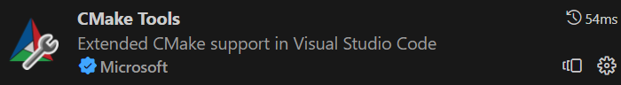
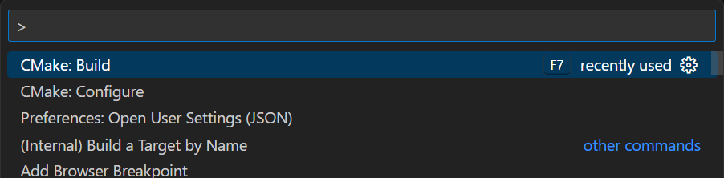

# CMake 入门

CMake是一个跨平台的安装（编译）工具，可以用简单的语句来描述所有平台的安装（编译过程），开发者通过编写一种与平台无关的 CMakeList.txt 文件来定制整个编译流程，然后再根据目标用户的平台进一步生成所需的本地化 Makefile 和工程文件。CMake能够有效地描述这些文件之间的依赖关系以及处理命令，当个别文件改动后仅执行必要的处理，而不必重复整个编译过程，可以大大提高软件开发的效率。

本次作业我们推荐使用VS Code的官方CMake插件:

在使用上十分简单：用vscode打开目标文件夹（通常是有CMakeLists.txt的根目标），然后ctrl+shift+p打开命令菜单，输入`CMake:build`,如下图：

CMake插件就会自动构建并编译当前项目，得到可执行文件。