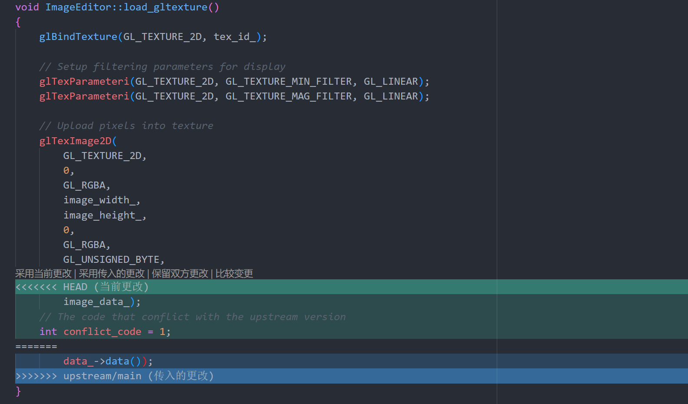

# GitHub 简略使用说明

> [官网](https://desktop.github.com/)，[下载链接](https://central.github.com/deployments/desktop/desktop/latest/win32)，[官方文档](https://help.github.com/en/desktop) 

- GIT: 是一个面向开源及私有软件项目的托管平台，是一个分布式的版本控制软件，它可以有效、高速地处理各种项目的版本管理。
- GitHub: 是 Git 的一个托管平台（把本地的代码历史上传到云端），相对于传统的SVN(Subversion)，GitHub具有更强大的功能，已成为当前人们用来管理代码及各种文档的利器。

## Git

教程

- [廖雪峰 Git 教程](https://www.liaoxuefeng.com/wiki/896043488029600) 
- [Git 教程 | 菜鸟教程](https://www.runoob.com/git/git-tutorial.html) 

需要学会以下几个重要的命令：

- `git log`：查看历史版本信息
- `git reset --soft <hash-code>`：跳转到任意版本，保留代码不变
- `git reset --hard <hash-code>`：跳转到任意版本，代码改变，谨慎使用
- `git push origin master -f`：当将本地代码推到 GitHub 后还想撤销时，先本地回退到相应版本，然后用此命令将本地版本强推到 GitHub 上

## GitHub

官方教程：[https://lab.github.com/](https://lab.github.com/) 

## GitHub Desktop

Github Desktop是GitHub的客户端（桌面端）软件 ，它与GitHub进行在线同步，可简化 Git 与 GitHub 间的操作，是 Git 功能的简单封装。可以完成一般的操作，但复杂的操作就只能使用 Git 的命令行。推荐使用！

必须学会**冲突**的解决（在 merge 其他分支到 `master` 分支的时候很容易产生冲突）

学习文档： [https://help.github.com/en/desktop](https://help.github.com/en/desktop) 

## Private Fork 工作流

> 参考来源：https://gist.github.com/0xjac/85097472043b697ab57ba1b1c7530274

### 1. 初始化

- 使用 [the Import a Repository feature](https://github.com/new/import) 拷贝 `https://github.com/USTC-CG/USTC_CG_24` 得到自己的**私有库** 

- 将该私有库 `clone` 到本地

- 在库的本地根目录执行

  ```bash
  git remote add upstream https://github.com/USTC-CG/USTC_CG_24.git
  git remote set-url --push upstream DISABLE
  ```

### 2. 从 USTC_CG_24 拉取更新 

**助教会在此仓库发布作业框架、文档的更新，**

- 在库的本地根目录执行

```bash
git fetch upstream
```

  之后进行获取分支的合并。

合并方式有以下两种：

#### 命令行方式

```bash
git merge upstream/main
```

然后可以使用visual studio code编辑器来解决冲突。

#### Github Desktop 方式

- 在 GitHub Desktop 中，点击菜单栏的 `branch->merge into current branch`，弹出的窗口中选择 other branches 的 `upstream/main` 

- 如果没有冲突，则可点击下边的 "Merge `upstream/main` into `main`“；否则，merge 时需要解决相应冲突才能 merge 成功

## 冲突解决

有时候，本地分支和被合并的分支之间会存在冲突，这个时候不能正常合并分支，下面是一个例子：

执行 merge 命令
```bash
git merge upstream/main
```
后，有可能会报错：
```
error: Your local changes to the following files would be overwritten by merge:
        Framework2D/src/view/comp_image.cpp
Please commit your changes or stash them before you merge.
Aborting
Updating e961128..deba33f
```

这是因为本地对 `Framework2D/src/view/comp_image.cpp` 文件进行了修改，但是并未提交这个修改到本地仓库中，直接 merge 会导致自己对这个文件的修改丢失。

因此，需要首先把自己的修改提交，输入

```bash
git commit -a -m "Your discription to the commit"
```

然后执行
```bash
git merge upstream/main
```

此时有可能会出现下面的输出
```
Auto-merging Framework2D/src/view/comp_image.cpp
CONFLICT (content): Merge conflict in Framework2D/src/view/comp_image.cpp
Automatic merge failed; fix conflicts and then commit the result.
```

这是因为本地的 `Framework2D/src/view/comp_image.cpp` 和上游仓库更新的 `Framework2D/src/view/comp_image.cpp` 存在**冲突**。用 vscode 打开这个冲突的文件，会发现用 
```
<<<<<<
// 本地代码 
======
// merge 传入的更改代码
>>>>>>
```
框起来的代码段，例如：
<div align=center></div align>

解决这部分冲突，你可以直接点击上方的 `采用传入的更改`，或者根据你自己的理解进行修正。
- 如果全部采用传入的更改，就相当于放弃原来自己的修改，和上游仓库的版本保持一致。
- 如果打算保留自己对这部分文件的一些修改，你需要谨慎处理冲突，否则程序可能会出错。

解决完冲突以后，再 commit 这一次 merge
```bash
git commit -a
```

以上就成功合并 `upstream/main` 分支到本地分支了。

也可以用下面的命令定位到冲突文件：

```bash
git diff --check
```

> 如果你使用的是 Github Desktop 或者 Sourcetree 等图形界面，它们应该内置了方便的冲突解决功能，可以搜索相关教程自行了解。

